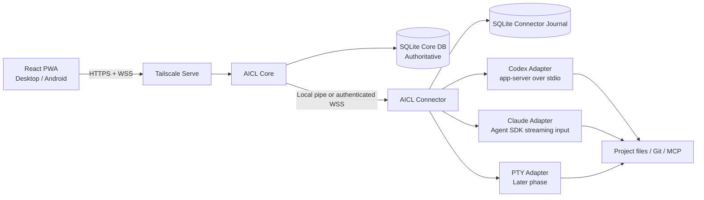

# AICL Mission Control

## Enterprise-Grade Single-User Architecture, Reliability, Database, and UX Specification

**Document version:** 2.2  
**Date:** 2026-08-01  
**Status:** Proposed implementation specification after correctness audit  
**Target environment:** Windows-first, private tailnet, one operator, multiple devices, multiple AI CLI accounts, optional multiple Connector machines

---

## Executive decision

สร้างระบบเป็น **single-tenant mission-control command center** ไม่ใช่ SaaS หลายผู้ใช้ และไม่ใช่ WebSocket wrapper ที่ผูกกับ CLI โดยตรง

รูปแบบที่แนะนำ:

- ผู้ใช้งานหนึ่งคน แต่เปิดจากหลายอุปกรณ์ได้
- รองรับหลายโปรเจกต์ หลายบัญชี AI และหลาย Session
- `AICL Core` เป็น modular monolith และ authoritative coordinator
- `AICL Connector` เป็น process แยกเพื่อควบคุม AI CLI และ filesystem
- ใช้ SQLite WAL เป็น authoritative Core database สำหรับ single-host deployment
- ใช้ SQLite อีกไฟล์เป็น durable Connector journal
- PostgreSQL เป็น scale-up profile ไม่ใช่ dependency เริ่มต้น
- ใช้ Tailscale Serve สำหรับ private HTTPS/WSS
- ใช้ versioned normalized protocol; frontend ไม่เห็น provider event ดิบ
- ทุก command มี `commandId`, state machine, transaction และ recovery path
- `last_event_seq` ใช้ replay durable events; resource revision ใช้เฉพาะ optimistic concurrency ของ resource นั้น
- approval ใช้ compare-and-set ที่ approval row พร้อม runtime generation และ expiry ไม่ใช้ global session revision
- Codex/Claude baseline ไม่รองรับ provider-process reattach หลัง Connector restart
- มี executing Turn ต่อ Session ได้หนึ่งตัว; active turn อยู่แล้วให้ reject `TURN_ALREADY_ACTIVE`
- diff หรือ payload ใหญ่ใช้ authenticated artifact endpoint ไม่ฝืน WebSocket limit
- failure ที่พิสูจน์ผลไม่ได้ใช้ `outcome_unknown`; ห้าม auto-resubmit
- UI เป็น aerospace mission-control aesthetic: ข้อมูลหนาแน่น อ่าน state ได้ภายในหนึ่งวินาที ใช้สีน้อย และไม่ใช้ animation รบกวนงาน

> เป้าหมายไม่ใช่คำสัญญาว่า “ไม่มีวันผิดพลาด” เป้าหมายคือ **ไม่สูญข้อมูลหรือส่งซ้ำอย่างเงียบ ๆ, ไม่แสร้งว่ารู้ผลเมื่อพิสูจน์ไม่ได้, และมี recovery path ที่ตรวจสอบได้**

## Version 2.2 correctness decisions

1. Core-generated events ไม่ใช้ nullable source pair เป็น unique key
2. durable event sequence แยกจาก resource revision
3. approval concurrency ใช้ approval-row CAS
4. Connector restart ทำให้ stdio/SDK runtime lost เสมอ
5. baseline ไม่มี dormant `queued` Turn state
6. inline diff ต้องเล็กกว่า WebSocket envelope limit
7. SQLite เป็น default; Connector count ไม่ใช่เหตุผลเลือก PostgreSQL
8. Codex protocol spike เกิดก่อน foundation เต็มชุด

# 1. Product definition

## 1.1 ชื่อระบบ

ชื่อใช้งานในเอกสาร:

```text
AICL Mission Control
```

โมดูลหลัก:

```text
AICL Web           React PWA / Mission Control UI
AICL Core          Session, command, event, approval, database, WebSocket
AICL Connector     Local process supervisor and provider adapters
AICL CLI           Local administrative and diagnostic client
AICL Updater       Signed update and rollback manager
```

## 1.2 ผู้ใช้เป้าหมาย

ผู้ใช้หนึ่งคนที่ต้องการ:

- เปิด Session ของ Codex, Claude และ provider อื่นจากมือถือหรือคอมพิวเตอร์
- ดูหลาย Session พร้อมกัน
- ส่ง prompt, interrupt, resume, fork และ archive
- ดู command output, tool calls, file changes และ token usage
- อนุมัติหรือปฏิเสธการรันคำสั่งและแก้ไฟล์
- เปลี่ยน project, model, account profile และ approval policy
- กลับเข้ามาหลัง browser, network, Core, Connector หรือ provider process หลุด
- ตรวจสอบเหตุการณ์ย้อนหลังและรู้ชัดว่าคำสั่งใดสำเร็จ ล้มเหลว หรือยังพิสูจน์ไม่ได้

## 1.3 Enterprise-grade ในบริบทนี้หมายถึงอะไร

Enterprise-grade ไม่ได้หมายถึงต้องมี organization, billing, team role หรือ Kubernetes แต่หมายถึง:

- schema และ protocol มี version
- ข้อมูลสำคัญถูก commit ก่อน broadcast
- มี idempotency และ duplicate detection
- มี state machine ที่บังคับ transition
- มี durable command journal, bounded queues และ transactional outbox
- มี crash recovery และ reconciliation
- มี backup, restore drill และ migration rollback
- มี structured logs, metrics, health checks และ incident record
- มี permission boundary และ project allowlist
- provider version incompatibility ต้องหยุดอย่างปลอดภัย ไม่ใช่พยายามทำงานต่อแบบเดา
- UI ไม่ปกปิดความไม่แน่นอนของระบบ

---

# 2. Goals and non-goals

## 2.1 เป้าหมายหลัก

1. **Single operator, multi-device**  
   ใช้งานคนเดียว แต่เปิดจาก Windows, Android, tablet หรือ notebook ได้

2. **Provider-independent frontend**  
   Frontend รู้จักเฉพาะ normalized protocol

3. **Durable command execution**  
   ทุกคำสั่งถูกบันทึกก่อน dispatch และตรวจสถานะได้

4. **Recoverable sessions**  
   Session อยู่ต่อแม้ browser หรือ runtime หาย

5. **Explicit uncertainty**  
   เมื่อพิสูจน์ผลข้าม process boundary ไม่ได้ ให้แสดง `outcome_unknown`

6. **Strong single-host persistence**  
   SQLite WAL เป็น source of truth พร้อม constraints, migrations, verified backups และ restore drills

7. **Private-by-default networking**  
   เข้าผ่าน tailnet เท่านั้น ไม่มี public endpoint ในค่าเริ่มต้น

8. **Mission-control UX**  
   อ่านสถานะหลาย process ได้รวดเร็วโดยไม่ต้องเปิดหลายหน้า

9. **Extensible execution topology**  
   เริ่มต้นทุก service บนเครื่องเดียว แต่แยก Core/Connector process และ protocol เพื่อเพิ่ม Connector เครื่องอื่นได้โดยไม่ให้ Connector เข้าถึง Core DB โดยตรง

10. **Empirical provider integration**  
    schema และ performance default ต้องมาจาก binary/trace ที่รันจริง ไม่ใช่สมมติจากเอกสาร

## 2.2 สิ่งที่ไม่ใช่เป้าหมายของรุ่นแรก

- ระบบ SaaS สาธารณะ
- หลายผู้ใช้หรือหลายองค์กร
- billing และ subscription management
- marketplace
- public anonymous access
- generic remote desktop
- generic unrestricted shell API
- Kubernetes หรือ horizontal autoscaling
- exactly-once execution ข้าม provider ทุกกรณี
- automatic retry ของคำสั่งที่อาจมี side effect โดยไม่มีการยืนยันจากผู้ใช้

---

# 3. System architecture

## 3.1 Logical architecture



PostgreSQL สามารถแทน Core SQLite ได้ใน scale-up profile โดยไม่เปลี่ยน Web/Connector protocol

## 3.2 Physical deployment: recommended first installation

ทุก component อยู่บน Windows เครื่องหลัก แต่ Core และ Connector แยก service:

```text
Windows Host
├─ Tailscale
├─ AICL Core Windows Service
│  ├─ HTTP/WSS server
│  ├─ static PWA assets
│  ├─ command/session/event services
│  ├─ single database-writer actor
│  └─ C:\ProgramData\AICL\data\aicl-core.db
├─ AICL Connector Windows Service
│  ├─ process supervisor
│  ├─ provider adapters
│  ├─ C:\ProgramData\AICL\data\aicl-connector.db
│  └─ filesystem boundary
├─ Codex CLI / app-server
└─ Claude Code / Agent SDK runtime
```

Core และ Connector แยก process เพราะ:

- provider crash ไม่ควรทำให้ Web UI และ authoritative database ล่ม
- update Connector ได้โดยไม่ปิด UI ทั้งระบบ
- security boundary ชัดเจน
- เพิ่ม Connector เครื่องอื่นได้โดยไม่เปลี่ยน frontend protocol
- fault injection ของ Core/Connector restart ทำได้จริง

Core DB และ Connector journal ต้องเป็นคนละไฟล์เพื่อรักษา execution boundary

## 3.3 Network path

```text
Android / Laptop
       │
       │ tailnet HTTPS/WSS
       ▼
Tailscale Serve
       │ localhost only
       ▼
AICL Core :8787
       │
       ├─ local named pipe เมื่อ Connector อยู่เครื่องเดียวกัน
       └─ authenticated outbound WSS เมื่อ Connector อยู่เครื่องอื่น
```

กฎบังคับ:

- Core bind ที่ `127.0.0.1` เมื่อใช้ Tailscale Serve บนเครื่องเดียวกัน
- ห้ามเปิด Tailscale Funnel ในค่าเริ่มต้น
- Core SQLite files อยู่ local NTFS; ห้ามวางบน SMB/NAS/OneDrive-synced path
- PostgreSQL scale-up profile ห้ามรับ connection จาก tailnet/LAN โดยไม่มี deployment policy โดยตั้งใจ
- Browser ห้ามเชื่อม Codex App Server หรือ Claude SDK process โดยตรง
- Connector ทุกเครื่องคุยกับ Core protocol เท่านั้นและห้าม mutate Core DB

Tailscale Serve ใช้แชร์ local service ภายใน tailnet ส่วน Funnel คือ public exposure และไม่อยู่ใน baseline

# 4. Component responsibilities

## 4.1 AICL Web

หน้าที่:

- authentication และ app lock
- dashboard หลาย Session
- timeline streaming
- command composer
- diff viewer
- approval dock
- system telemetry
- reconnect และ replay cursor
- offline/read-only mode เมื่อ Core เข้าไม่ถึง

ข้อห้าม:

- ห้าม import Codex-generated types หรือ Claude SDK event types
- ห้ามคำนวณ authoritative session state เอง
- ห้ามถือ secret ของ provider
- ห้าม dispatch provider command โดยไม่ผ่าน Core

## 4.2 AICL Core

Core เป็น authoritative coordinator:

- Session Manager
- Runtime Manager
- Turn Manager
- Command Dispatcher
- Approval Manager
- Event Store
- WebSocket Gateway
- Connector Registry
- Project and Profile Registry
- Artifact Service
- Notification Service
- Backup Coordinator
- Health and Incident Service
- Protocol Compatibility Registry
- single database-writer actor

Core ตัดสิน authoritative state จาก committed database transaction ไม่ใช่จาก memory หรือ WebSocket delivery

## 4.3 AICL Connector

Connector เป็น execution boundary บนเครื่องที่มีไฟล์และ AI CLI:

- probe provider และ version
- spawn, supervise และ terminate provider runtime
- map provider thread/session ID กับ AICL Session
- normalize provider events
- enforce project-root allowlist
- enforce provider-profile environment
- persist inbound command IDs ใน local journal
- persist outbound durable events ก่อนส่ง Core
- replay journal หลัง Core/network reconnect
- report heartbeat, boot ID และ owned-runtime inventory
- preserve runtime เมื่อ Core channel/Core process restart แต่ Connector process เดิมยังอยู่
- mark runtime lost เมื่อ Connector process restart เพราะ stdio/SDK ownership สูญหาย
- cleanup orphan process เฉพาะเมื่อพิสูจน์ launch identity ได้

Connector restart ไม่ทำ provider-process reattach ใน Codex/Claude baseline

## 4.4 Core SQLite database

`aicl-core.db` เป็น source of truth สำหรับ:

- metadata
- current projections
- command lifecycle
- durable event sequence
- approvals
- connector and runtime leases
- artifact metadata
- migration state
- operational incidents
- backup metadata
- transactional outbox

Core มี writer actor หนึ่งตัวและใช้ `BEGIN IMMEDIATE` สำหรับ mutations

PostgreSQL เป็น optional scale-up profile เมื่อมี multi-Core writers, remote database, HA/PITR, multi-user workload หรือ measured SQLite bottleneck

## 4.5 Connector SQLite journal

`aicl-connector.db` ไม่ใช่ฐานข้อมูลหลัก แต่เป็น durable bridge:

- เก็บ command ที่รับแล้วเพื่อ deduplicate
- เก็บ provider durable event ที่ยังส่ง Core ไม่สำเร็จ
- เก็บ runtime checkpoint ขั้นต่ำ
- เก็บ boot ID และ launch identity ของ process
- ทำให้ Core restart หรือ network หลุดโดยไม่ทำ event ที่ Connector รับแล้วหาย

journal ไม่ทำให้ provider runtime reattach ได้หลัง Connector process ตาย; มันช่วย reconciliation และ resume ใน runtime ใหม่เท่านั้น

# 5. Core design principles

## 5.1 Normalize and classify before persistence or delivery

Frontend ห้ามเห็น event ดิบของ Codex หรือ Claude

ทุก provider message ผ่าน:

```text
provider schema validation
        ↓
adapter normalization
        ↓
runtime/turn generation validation
        ↓
classification: durable event | ephemeral frame
```

### Durable events

ตัวอย่าง:

- Session/Runtime/Turn/Command state transition
- item started/completed
- approval requested/resolved/expired/invalidated
- authoritative file-change set
- final command result
- final assistant message
- terminal error/incident
- usage summary
- stream checkpoint

เส้นทาง:

```text
Connector journal commit when Connector-originated
        ↓
Core ingest and source dedupe
        ↓
Core database transaction
  ├─ allocate durable session seq
  ├─ append session event
  ├─ update projection when applicable
  └─ insert outbox when applicable
        ↓ commit
WebSocket broadcast
```

### Ephemeral frames

ตัวอย่าง:

- assistant token/text delta
- reasoning-summary delta
- stdout/stderr delta
- transient progress tick

เส้นทาง:

```text
validate size/order/generation
        ↓
coalesce 20–50 ms
        ↓
broadcast immediately
        ↓
periodic durable checkpoint
```

`message.completed` หรือ terminal item record เป็น authoritative source of truth

## 5.2 Append before broadcast

กฎนี้ใช้กับ **durable event** เท่านั้น:

> Durable event ต้อง commit ก่อน broadcast เพราะ browser ห้ามเห็น authoritative state ที่ database ยังไม่มี

Ephemeral stream frame ใช้ validate-before-broadcast, coalesce และ checkpoint ตาม §20.3 โดยไม่ทำ transaction ต่อ token

- `last_event_seq` เพิ่มเฉพาะ durable event/checkpoint
- resource revision ไม่เพิ่มเพียงเพราะมี stream checkpoint
- terminal event flush และ commit ทันที
- frontend ที่ reconnect ใช้ durable replay + stream snapshot/checkpoint

## 5.3 State is not inferred from UI

สถานะใน UI มาจาก Core projection เท่านั้น ตัวอย่าง:

```text
Session: running
Runtime: healthy
Turn: awaiting_approval
Connection: reconnecting
```

แต่ละสถานะเป็นคนละมิติ ห้ามรวมเป็น boolean เดียว เช่น `isRunning`

## 5.4 Commands are durable records

ทุก action จาก UI ต้องกลายเป็น Command record ก่อน เช่น:

- create session
- start turn
- interrupt
- approve
- decline
- resume runtime
- archive session
- switch profile

## 5.5 No automatic replay of ambiguous side effects

ถ้า Core หรือ Connector crash หลัง provider อาจรับคำสั่งแล้ว แต่ก่อนบันทึก acknowledgement ระบบต้อง:

- mark command/turn เป็น `outcome_unknown`
- reconcile history ถ้า provider รองรับ
- แสดงคำเตือน
- ให้ผู้ใช้ตัดสินใจว่าจะเริ่มคำสั่งใหม่หรือไม่

ห้ามส่ง prompt หรือ command เดิมซ้ำอัตโนมัติ

---

# 6. Domain model

## 6.1 Session

Session คือ identity ระยะยาวของงาน

```ts
interface Session {
  id: string;
  provider: "codex" | "claude" | "pty";
  providerSessionId: string | null;
  projectId: string;
  cwd: string;
  accountProfileId: string;
  modelId: string | null;
  title: string;
  status: SessionStatus;
  stateRevision: number;
  lastEventSeq: bigint;
  createdAt: string;
  updatedAt: string;
  archivedAt: string | null;
}
```

`stateRevision` เพิ่มเมื่อ Session projection/config เปลี่ยน ส่วน `lastEventSeq` เพิ่มต่อ durable event

Session ยังอยู่เมื่อ:

- browser ปิด
- Connector disconnected
- runtime process จบ
- Windows restart
- provider process crash

## 6.2 Runtime

Runtime คือ instance ของ provider process/client ที่กำลังถือ Session

```ts
interface Runtime {
  id: string;
  sessionId: string;
  connectorId: string;
  generation: number;
  revision: number;
  connectorBootId: string;
  pid: number | null;
  processStartedAt: string | null;
  state: RuntimeState;
  leaseExpiresAt: string | null;
  providerVersion: string;
  schemaFingerprint: string | null;
  startedAt: string;
  endedAt: string | null;
}
```

กฎ generation:

- spawn provider runtime process/client ใหม่ → เพิ่ม `generation`
- Core/channel reconnect ขณะที่ Connector process เดิมยังถือ runtime → generation เดิม
- Connector process restart หรือ Windows restart → runtime เก่า lost; resume ใน runtime generation ใหม่
- Codex stdio และ Claude Agent SDK baseline ไม่มี process reattach

## 6.3 Connection

Connection คือ browser tab หรือ PWA instance ที่กำลังเชื่อมต่อ

```ts
interface ClientConnection {
  id: string;
  deviceId: string;
  connectedAt: string;
  subscriptions: Set<string>;
  lastAcknowledgedSeq: Map<string, bigint>;
}
```

Connection เป็น ephemeral และไม่ใช่ Session

## 6.4 Turn

Turn คือหนึ่งรอบคำสั่งจากผู้ใช้ถึง terminal outcome

```ts
interface Turn {
  id: string;
  sessionId: string;
  runtimeId: string | null;
  clientCommandId: string;
  providerTurnId: string | null;
  state: TurnState;
  revision: number;
  startedAt: string | null;
  completedAt: string | null;
  failureCode: string | null;
}
```

baseline ไม่มี server-side queued Turn; active Turn อยู่แล้วให้ reject `TURN_ALREADY_ACTIVE`

## 6.5 Approval

Approval ต้องผูกครบทุก scope:

```ts
interface ApprovalRequest {
  id: string;
  sessionId: string;
  runtimeId: string;
  runtimeGeneration: number;
  turnId: string;
  providerRequestId: string;
  actionType: "command" | "file_change" | "network" | "tool";
  state: ApprovalState;
  revision: number;
  expiresAt: string;
  payload: unknown;
}
```

Approval resolution ใช้ compare-and-set บน approval row เอง พร้อม runtime generation, turn state และ expiry ไม่ใช้ global session revision

Approval ของ runtime generation เก่าห้ามนำกลับมาใช้กับ generation ใหม่

# 7. State machines

## 7.1 Session states

```text
created
ready
running
awaiting_approval
degraded
lost
completed
failed
archived
```

Session state เป็น projection จาก runtime และ turn ล่าสุด แต่ต้องบันทึกเป็น authoritative projection ใน transaction เดียวกับ event

## 7.2 Runtime states

```text
starting
healthy
degraded
stopping
stopped
crashed
lost
incompatible
```

## 7.3 Turn states

```text
committed
dispatching
accepted
streaming
awaiting_approval
interrupting
interrupted
completed
failed
outcome_unknown
```

ไม่มี `queued` ใน baseline

เมื่อมี state ในกลุ่ม executing อยู่แล้ว:

```text
turn.submit → TURN_ALREADY_ACTIVE
```

future FIFO queue ต้องเป็น feature/migration แยกพร้อม reorder/cancel/stale-prompt semantics ไม่ใช่ dormant enum

## 7.4 Command states

```text
received
validated
committed
dispatching
accepted
rejected
completed
failed
expired
outcome_unknown
```

## 7.5 Approval states

```text
pending
approved_once
approved_session
declined
expired
invalidated
```

## 7.6 Transition enforcement

ห้าม update state แบบอิสระจาก application code หลายจุด

ใช้ transition service กลางพร้อม explicit transition table และ database predicates

ทุก transition ต้อง:

- ตรวจ expected previous state/resource revision
- ตรวจ runtime generation เมื่อเกี่ยวข้อง
- update projection
- append durable event
- insert outbox เมื่อเกี่ยวข้อง
- commit ใน transaction เดียวกัน
- ตรวจ affected row เท่ากับหนึ่ง

SQLite writer actor + `BEGIN IMMEDIATE` serialize writes แต่ไม่แทน application-level state guards

# 8. Protocol design

## 8.1 Versioned envelope

```ts
interface ProtocolEnvelope<T> {
  protocol: "aicl";
  protocolVersion: 1;
  messageId: string;
  sentAt: string;
  type: string;
  payload: T;
}
```

## 8.2 Client command envelope

```ts
interface ResourcePrecondition {
  resourceType: "session" | "runtime" | "turn" | "approval";
  resourceId: string;
  expectedRevision: number;
}

interface ClientCommand<T = unknown> {
  commandId: string;
  connectionId: string;
  sessionId: string | null;
  precondition?: ResourcePrecondition;
  type: CommandType;
  payload: T;
}
```

`commandId` สร้างจาก client และ unique แบบ UUIDv7/ULID

Approval command ใช้ approval revision ไม่ใช้ Session revision

## 8.3 Durable event and ephemeral frame envelopes

```ts
interface StoredEvent<T = unknown> {
  eventId: string;
  sessionId: string;
  seq: bigint;
  schemaVersion: number;
  origin: "core" | "connector";
  runtimeId: string | null;
  runtimeGeneration: number | null;
  turnId: string | null;
  sourceConnectorId: string | null;
  sourceEventId: string | null;
  type: NormalizedEventType;
  payload: T;
  createdAt: string;
}
```

กฎ source:

- `origin=core` → source fields เป็น null ทั้งคู่
- `origin=connector` → source fields ต้องมีทั้งคู่

```ts
interface EphemeralStreamFrame<T = unknown> {
  protocolVersion: 1;
  frameClass: "ephemeral";
  sessionId: string;
  runtimeId: string;
  runtimeGeneration: number;
  turnId: string;
  itemId: string;
  streamId: string;
  streamSeq: number;
  afterDurableSeq: bigint;
  type:
    | "message.delta"
    | "reasoning.summary.delta"
    | "command.output.delta"
    | "progress.tick";
  payload: T;
  emittedAt: string;
}
```

`streamSeq` มี scope ต่อ stream และไม่ใช่ durable event sequence

## 8.4 WebSocket message families

Client to Core:

```text
client.hello
session.subscribe
session.unsubscribe
cursor.ack
command.submit
command.cancel  # only before dispatch, with explicit state guard
ping
```

Core to Client:

```text
server.hello
subscription.snapshot
event.batch
event.live
command.ack
command.result
system.notice
reconnect.required
pong
```

Core to Connector:

```text
connector.hello
runtime.start
runtime.resume
turn.submit
turn.interrupt
approval.resolve
runtime.stop
inventory.request
journal.ack
```

Connector to Core:

```text
connector.ready
connector.heartbeat
runtime.inventory
runtime.status
provider.event
provider.error
journal.replay.completed
```

## 8.5 Subscribe and replay handshake

```text
1. Client connects
2. Client sends client.hello
3. Client sends session.subscribe { sessionId, afterSeq }
4. Core returns subscription.snapshot
5. Core returns persisted events where seq > afterSeq
6. Core switches connection to live delivery
7. Client periodically sends cursor.ack
```

ต้องมี barrier ระหว่าง replay กับ live stream เพื่อไม่ให้ event หายหรือซ้ำจาก race condition

แนวทาง:

- Core อ่าน `last_event_seq` เป็น replay upper bound
- replay ถึง upper bound
- จากนั้น drain outbox/live buffer ที่มากกว่า upper bound
- duplicate ที่ client ได้รับต้อง dedupe ด้วย `eventId`

---

# 9. Database architecture

## 9.1 Storage policy

ใช้ฐานข้อมูลสองไฟล์:

```text
C:\ProgramData\AICL\data\aicl-core.db
  = authoritative Core source of truth

C:\ProgramData\AICL\data\aicl-connector.db
  = Connector command/event journal and runtime checkpoints
```

- ไฟล์ทั้งสองอยู่ local NTFS
- ห้ามวางบน SMB, NAS หรือ sync folder
- ใช้ migration/query layer family เดียวกันได้ แต่ execution boundary แยก
- Connector ห้ามเปิดหรือ mutate `aicl-core.db`
- PostgreSQL เป็น scale-up profile ไม่ใช่ dependency baseline

## 9.2 SQLite runtime gate and pragmas

Startup gate:

```sql
SELECT sqlite_version();
PRAGMA compile_options;
```

ขั้นต่ำ:

- SQLite 3.37+ สำหรับ STRICT tables
- SQLite 3.35+ สำหรับ `RETURNING`
- JSON functions ใช้งานได้
- default payload storage เป็น canonical JSON text + `CHECK(json_valid(...))`

ทุก connection:

```sql
PRAGMA foreign_keys = ON;
PRAGMA busy_timeout = 5000;
PRAGMA trusted_schema = OFF;
```

bootstrap/migration:

```sql
PRAGMA journal_mode = WAL;
PRAGMA synchronous = FULL;
PRAGMA wal_autocheckpoint = 1000;
```

Core มี single database-writer actor และ read connections แยก

## 9.3 Core tables

```text
operator_identity
operator_devices
connectors
provider_profiles
provider_schema_versions
projects
project_roots
sessions
runtimes
turns
commands
approval_requests
session_events
file_change_sets
artifacts
connection_cursors
transactional_outbox
system_incidents
backup_runs
settings
schema_migrations
```

## 9.4 Recommended schema: key tables

### `sessions`

```sql
CREATE TABLE sessions (
  id                    TEXT PRIMARY KEY,
  provider              TEXT NOT NULL,
  provider_session_id   TEXT,
  project_id            TEXT NOT NULL REFERENCES projects(id),
  cwd                   TEXT NOT NULL,
  account_profile_id    TEXT NOT NULL REFERENCES provider_profiles(id),
  model_id              TEXT,
  title                 TEXT NOT NULL,
  status                TEXT NOT NULL,
  state_revision        INTEGER NOT NULL DEFAULT 0 CHECK (state_revision >= 0),
  last_event_seq        INTEGER NOT NULL DEFAULT 0 CHECK (last_event_seq >= 0),
  created_at            TEXT NOT NULL,
  updated_at            TEXT NOT NULL,
  archived_at           TEXT
) STRICT;
```

### `runtimes`

```sql
CREATE TABLE runtimes (
  id                    TEXT PRIMARY KEY,
  session_id            TEXT NOT NULL REFERENCES sessions(id),
  connector_id          TEXT NOT NULL REFERENCES connectors(id),
  connector_boot_id     TEXT NOT NULL,
  generation            INTEGER NOT NULL CHECK (generation > 0),
  revision              INTEGER NOT NULL DEFAULT 0 CHECK (revision >= 0),
  pid                   INTEGER,
  process_started_at    TEXT,
  state                 TEXT NOT NULL,
  provider_version      TEXT NOT NULL,
  schema_fingerprint    TEXT,
  lease_expires_at      TEXT,
  started_at            TEXT NOT NULL,
  ended_at              TEXT,
  UNIQUE (session_id, generation),
  UNIQUE (id, generation)
) STRICT;

CREATE UNIQUE INDEX uq_runtime_one_active_per_session
ON runtimes(session_id)
WHERE state IN ('starting', 'healthy', 'degraded', 'stopping');
```

### `turns`

```sql
CREATE TABLE turns (
  id                    TEXT PRIMARY KEY,
  session_id            TEXT NOT NULL REFERENCES sessions(id),
  runtime_id            TEXT REFERENCES runtimes(id),
  client_command_id     TEXT NOT NULL UNIQUE,
  provider_turn_id      TEXT,
  state                 TEXT NOT NULL CHECK (state IN (
    'committed',
    'dispatching',
    'accepted',
    'streaming',
    'awaiting_approval',
    'interrupting',
    'interrupted',
    'completed',
    'failed',
    'outcome_unknown'
  )),
  revision              INTEGER NOT NULL DEFAULT 0 CHECK (revision >= 0),
  prompt_hash           TEXT NOT NULL,
  started_at            TEXT,
  completed_at          TEXT,
  failure_code          TEXT,
  failure_detail_json   TEXT CHECK (
    failure_detail_json IS NULL OR json_valid(failure_detail_json)
  ),
  created_at            TEXT NOT NULL,
  updated_at            TEXT NOT NULL
) STRICT;

CREATE UNIQUE INDEX uq_turn_one_executing_per_session
ON turns(session_id)
WHERE state IN (
  'committed',
  'dispatching',
  'accepted',
  'streaming',
  'awaiting_approval',
  'interrupting'
);
```

### `commands`

```sql
CREATE TABLE commands (
  id                            TEXT PRIMARY KEY,
  command_id                    TEXT NOT NULL UNIQUE,
  connection_id                 TEXT,
  session_id                    TEXT REFERENCES sessions(id),
  command_type                  TEXT NOT NULL,
  state                         TEXT NOT NULL,
  precondition_resource_type    TEXT,
  precondition_resource_id      TEXT,
  precondition_revision         INTEGER,
  payload_json                  TEXT NOT NULL CHECK (json_valid(payload_json)),
  payload_hash                  TEXT NOT NULL,
  result_json                   TEXT CHECK (result_json IS NULL OR json_valid(result_json)),
  dispatch_attempts             INTEGER NOT NULL DEFAULT 0 CHECK (dispatch_attempts >= 0),
  provider_dispatch_key         TEXT,
  received_at                   TEXT NOT NULL,
  committed_at                  TEXT,
  accepted_at                   TEXT,
  terminal_at                   TEXT,

  CHECK (
    (precondition_resource_type IS NULL
      AND precondition_resource_id IS NULL
      AND precondition_revision IS NULL)
    OR
    (precondition_resource_type IS NOT NULL
      AND precondition_resource_id IS NOT NULL
      AND precondition_revision IS NOT NULL)
  )
) STRICT;
```

### `session_events`

```sql
CREATE TABLE session_events (
  event_id                 TEXT PRIMARY KEY,
  session_id               TEXT NOT NULL REFERENCES sessions(id),
  seq                      INTEGER NOT NULL,
  schema_version           INTEGER NOT NULL,
  origin                   TEXT NOT NULL CHECK (origin IN ('core', 'connector')),
  runtime_id               TEXT REFERENCES runtimes(id),
  runtime_generation       INTEGER,
  turn_id                  TEXT REFERENCES turns(id),
  source_connector_id      TEXT REFERENCES connectors(id),
  source_event_id          TEXT,
  event_type               TEXT NOT NULL,
  payload_json             TEXT NOT NULL CHECK (json_valid(payload_json)),
  created_at               TEXT NOT NULL,

  UNIQUE (session_id, seq),

  CHECK (
    (origin = 'core'
      AND source_connector_id IS NULL
      AND source_event_id IS NULL)
    OR
    (origin = 'connector'
      AND source_connector_id IS NOT NULL
      AND source_event_id IS NOT NULL)
  ),

  CHECK (
    (runtime_id IS NULL AND runtime_generation IS NULL)
    OR
    (runtime_id IS NOT NULL AND runtime_generation IS NOT NULL)
  ),

  FOREIGN KEY (runtime_id, runtime_generation)
    REFERENCES runtimes(id, generation)
) STRICT;

CREATE UNIQUE INDEX uq_session_events_connector_source
ON session_events (source_connector_id, source_event_id)
WHERE origin = 'connector'
  AND source_connector_id IS NOT NULL
  AND source_event_id IS NOT NULL;
```

Core-generated events จึงมี `(NULL, NULL)` ได้ไม่จำกัด ส่วน connector-originated event dedupe ต่อ Connector

`source_event_id` ต้องสร้างเป็น UUIDv7/ULID ก่อน insert ลง Connector journal และห้าม reuse ข้าม boot; journal offset แบบ integer เป็นคนละค่าและห้ามใช้เป็น source ID

### `approval_requests`

```sql
CREATE TABLE approval_requests (
  id                       TEXT PRIMARY KEY,
  session_id               TEXT NOT NULL REFERENCES sessions(id),
  runtime_id               TEXT NOT NULL REFERENCES runtimes(id),
  runtime_generation       INTEGER NOT NULL,
  turn_id                  TEXT NOT NULL REFERENCES turns(id),
  provider_request_id      TEXT NOT NULL,
  action_type              TEXT NOT NULL,
  state                    TEXT NOT NULL,
  revision                 INTEGER NOT NULL DEFAULT 0 CHECK (revision >= 0),
  payload_json             TEXT NOT NULL CHECK (json_valid(payload_json)),
  expires_at               TEXT NOT NULL,
  resolved_by_device_id    TEXT,
  resolved_at              TEXT,
  created_at               TEXT NOT NULL,
  updated_at               TEXT NOT NULL,
  UNIQUE (runtime_id, provider_request_id),
  FOREIGN KEY (runtime_id, runtime_generation)
    REFERENCES runtimes(id, generation)
) STRICT;
```

### `transactional_outbox`

```sql
CREATE TABLE transactional_outbox (
  id              INTEGER PRIMARY KEY,
  topic           TEXT NOT NULL,
  aggregate_id    TEXT NOT NULL,
  event_id        TEXT NOT NULL UNIQUE,
  payload_json    TEXT NOT NULL CHECK (json_valid(payload_json)),
  available_at    TEXT NOT NULL,
  published_at    TEXT,
  attempts        INTEGER NOT NULL DEFAULT 0 CHECK (attempts >= 0),
  last_error      TEXT
) STRICT;
```

## 9.5 Sequence allocation and resource revisions

ห้ามใช้ `MAX(seq) + 1`

Pure durable event:

```sql
UPDATE sessions
SET last_event_seq = last_event_seq + 1,
    updated_at = :now
WHERE id = :session_id
RETURNING last_event_seq;
```

Session mutation:

```sql
UPDATE sessions
SET status = :next_status,
    state_revision = state_revision + 1,
    updated_at = :now
WHERE id = :session_id
  AND state_revision = :expected_revision
RETURNING state_revision;
```

resource revision เพิ่มเฉพาะ mutation ของ resource นั้น ไม่เพิ่มจาก event append helper

หนึ่ง transaction อาจ:

1. mutate resource ด้วย expected state/revision
2. allocate one or more durable seq values
3. append durable events
4. append outbox rows
5. commit

## 9.6 Writer actor and mutation guard

mutation ทุกตัวผ่าน queue เดียว:

```text
HTTP/WS/Connector handler
        ↓
validated command/event
        ↓
Core DB writer actor
        ↓
BEGIN IMMEDIATE
        ├─ expected state/revision predicate
        ├─ affected-row verification
        ├─ projection mutation
        ├─ durable event append
        └─ outbox insert
        ↓
COMMIT
        ↓
ack/broadcast
```

writer actor ต้องมี bounded queue, priority สำหรับ approval/interrupt/terminal events, write-latency metrics และ disk-full behavior

## 9.7 Approval compare-and-set

Approval resolution ไม่ตรวจ global Session revision:

```sql
UPDATE approval_requests
SET state = :resolved_state,
    revision = revision + 1,
    resolved_by_device_id = :device_id,
    resolved_at = :now,
    updated_at = :now
WHERE id = :approval_id
  AND state = 'pending'
  AND revision = :expected_approval_revision
  AND runtime_id = :runtime_id
  AND runtime_generation = :runtime_generation
  AND turn_id = :turn_id
  AND provider_request_id = :provider_request_id
  AND expires_at > :now
  AND EXISTS (
    SELECT 1 FROM runtimes r
    WHERE r.id = approval_requests.runtime_id
      AND r.generation = approval_requests.runtime_generation
      AND r.state IN ('starting', 'healthy', 'degraded')
  )
  AND EXISTS (
    SELECT 1 FROM turns t
    WHERE t.id = approval_requests.turn_id
      AND t.state = 'awaiting_approval'
  )
RETURNING id, state, revision;
```

Affected row เป็นศูนย์ต้อง fetch authoritative state แล้วคืน error เฉพาะสาเหตุ:

```text
APPROVAL_ALREADY_RESOLVED
APPROVAL_EXPIRED
APPROVAL_RUNTIME_CHANGED
APPROVAL_TURN_NOT_ACTIVE
STALE_APPROVAL_REVISION
```

## 9.8 Current projection, event log, and stream checkpoints

ระบบไม่ทำ full event sourcing

- projection tables เป็น authoritative current state
- `session_events` เป็น append-only durable timeline/audit/replay
- ephemeral frame ไม่ลงหนึ่งแถวต่อ token
- stream checkpoint เป็น durable event แต่ไม่เพิ่ม unrelated resource revision
- `message.completed` เก็บ full authoritative text

## 9.9 Raw provider diagnostics

Raw provider payload เก็บเฉพาะ diagnostic store แบบ:

- opt-in
- redacted
- short retention
- size-limited
- encrypted at rest
- ไม่ใช้เป็น frontend contract

## 9.10 PostgreSQL scale-up profile

เปลี่ยนเป็น PostgreSQL เมื่อ:

- มี Core writer มากกว่าหนึ่ง instance
- database อยู่คนละเครื่องกับ Core
- ต้องการ HA/failover/PITR จริง
- กลายเป็น multi-user/multi-tenant
- measured write/analytics/retention workload ทำให้ SQLite เป็น bottleneck
- local-disk fault domain ไม่ยอมรับได้

จำนวน Connector ไม่ใช่เหตุผล เพราะ Connector ห้าม mutate Core database โดยตรง

# 10. Connector journal design

## 10.1 SQLite pragmas

```sql
PRAGMA journal_mode = WAL;
PRAGMA foreign_keys = ON;
PRAGMA busy_timeout = 5000;
PRAGMA synchronous = FULL;
```

Connector journal มี write volume ต่ำกว่า Core จึงยอมใช้ `FULL` เพื่อความทนทานสูงกว่า

## 10.2 Tables

```text
inbox_commands
outbox_events
runtime_checkpoints
provider_processes
journal_metadata
```

### `inbox_commands`

เก็บ `command_id` ก่อน dispatch provider เพื่อ deduplicate การส่งซ้ำจาก Core

### `outbox_events`

เก็บ normalized provider event ก่อนส่ง Core

### `runtime_checkpoints`

เก็บ:

- session ID
- runtime ID
- generation
- provider session/thread ID
- PID
- process start time
- provider version
- last local event sequence
- last acknowledged Core journal offset

## 10.3 Journal acknowledgement

```text
Connector persists local event
Connector sends event to Core
Core commits and returns sourceEventId acknowledgement
Connector marks local row acknowledged
Retention worker deletes acknowledged rows after safety window
```

ห้ามลบทันทีหลังส่ง network สำเร็จ ต้องรอ Core commit acknowledgement

---

# 11. Command processing and idempotency

## 11.1 End-to-end command lifecycle

```text
1. Client creates commandId
2. Core validates protocol, identity, policy and payload hash
3. Core resolves resource-scoped precondition when present
4. Core writer actor begins transaction
5. Core inserts command as received/validated
6. Core creates or mutates required Turn/Approval/Runtime records
7. Core appends durable event/outbox and commits
8. Core acknowledges committed command record
9. Dispatcher sends command to Connector
10. Connector persists commandId in inbox journal
11. Connector dispatches provider at most once per journal record
12. Connector returns accepted or explicit failure
13. Core updates command and emits durable event
```

สำหรับ `turn.submit` Core ต้องสร้าง Turn ได้ต่อเมื่อ active-turn unique index อนุญาต มิฉะนั้นคืน `TURN_ALREADY_ACTIVE`

## 11.2 Duplicate submission

เมื่อ Core ได้ `commandId` เดิม:

- payload hash ตรงกัน: คืนสถานะเดิม
- payload hash ไม่ตรงกัน: reject ด้วย `IDEMPOTENCY_KEY_REUSE`
- ห้ามสร้าง command record ใหม่

เมื่อ Connector ได้ `commandId` เดิม:

- ถ้าเคย accepted: คืน acknowledgement เดิม
- ถ้ายัง dispatching: คืน current state
- ถ้า terminal: คืน terminal result
- ห้าม dispatch provider ซ้ำ

## 11.3 Resource-scoped optimistic concurrency

คำสั่งที่ขึ้นกับ state ปัจจุบันส่ง precondition ของ resource ที่กำลัง mutate

ตัวอย่าง:

```text
rename Session S when S.stateRevision = 12
interrupt Turn T when T.revision = 4 and runtime generation = 7
approve Approval A when A.revision = 0 and runtime generation = 7
```

ห้ามใช้ global Session revision สำหรับ approval เพราะ stream/checkpoint/session events ที่ไม่เกี่ยวข้องไม่ควรทำให้ approval stale

เมื่อ precondition ไม่ตรง ให้คืน error เฉพาะ resource พร้อม authoritative snapshot

## 11.4 Provider boundary

ระบบรับประกันได้:

- exactly-once command record ใน Core
- at-least-once transport Core → Connector
- deduplicated dispatch ใน Connector

ระบบไม่ควรอ้าง exactly-once ที่ boundary Connector → provider หาก provider ไม่รองรับ idempotency key

ถ้า crash อยู่ระหว่าง provider รับคำสั่งกับ Connector commit acknowledgement:

```text
command.state = outcome_unknown
turn.state = outcome_unknown
```

จากนั้นใช้ reconciliation แทน auto retry

---

# 12. Reconnect, recovery, and reconciliation

## 12.1 Browser disconnect

กรณี browser หรือ network หลุด แต่ Core และ provider ยังทำงาน:

- provider events ยังเข้า Connector journal
- Core ยัง commit events
- browser reconnect ด้วย `afterSeq`
- Core replay events
- pending approvals ถูกส่งกลับ
- live stream ดำเนินต่อโดยไม่สร้าง Turn ใหม่

นี่ต้องรองรับเต็มรูปแบบตั้งแต่ vertical slice แรก

## 12.2 Connector channel disconnect versus Connector process restart

### Channel/network disconnect while Connector process survives

- Connector ยังถือ provider stdio/SDK client
- provider event ลง local journal ต่อ
- Core mark Connector `disconnected` หลัง lease หมดและ runtime `degraded`
- เมื่อ channel กลับมา Connector replay journal
- runtime ID/generation เดิม
- นี่คือ reconnect ไม่ใช่ reattach

Connector ส่ง:

```text
connector identity
boot ID
journal high-water mark
owned live runtimes
runtime generation
provider session IDs
PID + process start time
provider versions
pending approval IDs
```

Core ตอบได้:

```text
continue_owned_runtime
resume_journal_replay
invalidate_approval
stop_verified_orphan
mark_outcome_unknown
spawn_new_runtime_and_resume_session
```

### Connector process restart/crash

boot ID เปลี่ยนหมายความว่า stdio/SDK ownership เก่าหาย

- mark runtime generation เก่า `lost`
- invalidate approvals ของ generation เก่า
- active Turn → `outcome_unknown` เว้นแต่ provider history พิสูจน์ terminal outcome
- ห้าม auto-resubmit
- ห้าม attempt process reattach
- Resume สร้าง provider process/client ใหม่และ generation ใหม่

## 12.3 Core restart

หลัง Core restart:

1. Core SQLite database เป็น authoritative state
2. Core เปิด recovery/read-only mode
3. migrations/integrity gate ผ่าน
4. outbox publisher resume จาก unpublished rows
5. Connector process เดิม reconnect และ replay journal
6. owned runtime ที่ Connector ยังถืออยู่ใช้ generation เดิม
7. runtime leases ถูกตรวจใหม่
8. browser reconnect และ replay ตาม durable seq
9. command ที่อยู่ `dispatching` ถูก reconcile ไม่ dispatch ซ้ำทันที

## 12.4 Provider process crash

Connector ตรวจด้วย PID และ process start time ไม่ใช่ PID อย่างเดียว

เมื่อ crash:

- persist `runtime.crashed`
- invalidate pending approvals ของ generation นั้น
- mark active turn `outcome_unknown` ถ้าพิสูจน์ terminal result ไม่ได้
- เก็บ stderr tail แบบ redacted
- เสนอ `Resume runtime` ใน UI
- ห้าม restart และ resubmit prompt อัตโนมัติ

## 12.5 Windows restart

Windows restart ทำให้ Core, Connector และ provider runtime process จบ

Connector startup sequence:

```text
load journal and boot metadata
create new connector boot ID
probe old runtime checkpoints
mark all old owned runtimes lost
validate and cleanup verified orphan metadata if any
start Core channel
send inventory/journal high-water mark
wait for reconciliation decision
spawn provider runtime generation ใหม่เมื่อผู้ใช้หรือ policy สั่ง resume
resume provider session/thread with stored cwd + profile
```

active Turn จาก generation ก่อน reboot เป็น `outcome_unknown` เว้นแต่ provider history หลัง resume มี terminal evidence ที่ตรวจสอบได้

ไม่มี `reattach` path

## 12.6 Reconciliation loop

background reconciler ตรวจ:

- runtime lease หมด
- Connector boot ID เปลี่ยน
- command stuck ใน `dispatching`
- approval หมดอายุ
- outbox publish ไม่สำเร็จ
- connector journal backlog
- provider process mismatch
- Core projection ไม่ตรงกับ owned-runtime inventory
- stream checkpoint/final-message consistency

reconciler ห้าม dispatch provider command ซ้ำจาก timeout เพียงอย่างเดียว

# 13. Provider adapter architecture

## 13.1 Adapter contract

```ts
interface ProviderAdapter {
  readonly provider: ProviderKind;

  probe(input: ProbeInput): Promise<ProviderProbeResult>;

  startSession(input: StartSessionInput): Promise<ProviderSessionHandle>;

  resumeSession(input: ResumeSessionInput): Promise<ProviderSessionHandle>;

  submitTurn(
    handle: ProviderSessionHandle,
    input: SubmitTurnInput
  ): Promise<ProviderDispatchReceipt>;

  interrupt(
    handle: ProviderSessionHandle,
    input: InterruptInput
  ): Promise<void>;

  resolveApproval(
    handle: ProviderSessionHandle,
    input: ResolveApprovalInput
  ): Promise<void>;

  reconcile(
    handle: ProviderSessionHandle,
    checkpoint: RuntimeCheckpoint
  ): Promise<ReconciliationResult>;

  events(
    handle: ProviderSessionHandle
  ): AsyncIterable<NormalizedProviderEvent>;

  shutdown(
    handle: ProviderSessionHandle,
    mode: "graceful" | "force"
  ): Promise<void>;
}
```

## 13.2 Capability model

```ts
interface ProviderCapabilities {
  supportsSessionResume: boolean;
  supportsProcessReattach: boolean;
  supportsConcurrentTurns: boolean;
  supportsInterrupt: boolean;
  supportsCommandApproval: boolean;
  supportsFileChangeApproval: boolean;
  supportsFork: boolean;
  supportsUsageEvents: boolean;
  supportsStructuredDiff: boolean;
}
```

Frontend render จาก capability ไม่ใช่ provider-name branching

baseline:

```text
Codex app-server over stdio:
  supportsProcessReattach = false

Claude Agent SDK client owned by Connector:
  supportsProcessReattach = false
```

`supportsSessionResume` ไม่เท่ากับ `supportsProcessReattach`

## 13.3 Adapter compatibility manifest

ทุก adapter build ต้องมี manifest:

```json
{
  "provider": "codex",
  "adapterVersion": "1.0.0",
  "testedProviderVersions": ["<exact versions or ranges>"],
  "schemaFingerprints": ["sha256:..."],
  "stableApiOnly": true
}
```

เมื่อ provider version หรือ schema fingerprint ไม่ตรง:

- probe ได้
- UI แสดง incompatibility
- ห้ามเริ่ม runtime ใหม่
- runtime เดิมไม่ถูก kill อัตโนมัติ
- ผู้ใช้เลือก rollback provider หรือ update adapter

---

# 14. Codex adapter

## 14.1 Transport

สำหรับ Windows ใช้:

```text
AICL Connector
    └─ child process
       └─ codex app-server over stdio
```

ไม่เปิด app-server ให้ browser เชื่อมโดยตรง

## 14.2 Schema source of truth

ห้ามยึด method name จากเอกสารนี้เป็น contract ถาวร

ขั้นตอนที่ถูกต้อง:

```powershell
codex --version
codex app-server generate-ts --out generated/codex
codex app-server generate-json-schema --out generated/codex-schema
```

Generated schema จาก Codex binary ที่ติดตั้งจริงเป็น source of truth ของ adapter build นั้น และค่าเริ่มต้นควรใช้ stable API surface โดยไม่เปิด experimental schema

Pipeline:

```text
Codex version discovered
        ↓
Generate schemas
        ↓
Canonicalize schema
        ↓
Compute fingerprint
        ↓
Compile adapter contract tests
        ↓
Record compatibility manifest
        ↓
Allow runtime start
```

## 14.3 Initialization

Connector ต้องทำ initialize handshake ตาม schema ที่ generate และส่ง client metadata ที่ระบุตัว AICL ชัดเจน

## 14.4 Backpressure

Codex App Server ใช้ bounded queues และสามารถตอบ overload error ได้ Adapter ต้อง:

- จำกัด outbound queue
- retry เฉพาะ error ที่จำแนกว่า retryable
- exponential backoff + jitter
- ไม่ retry side-effectful request ถ้าการรับคำสั่งไม่ชัดเจน
- surface `PROVIDER_OVERLOADED` ให้ UI

## 14.5 Windows lifecycle

ไม่ใช้ app-server daemon เป็น process manager baseline บน Windows

Connector จัดการ:

- spawn `codex app-server --stdio`
- stdin/stdout ownership
- stderr capture/redaction
- graceful stop และ forced process-tree stop
- PID + process-start-time verification
- launch marker สำหรับ orphan cleanup
- runtime generation
- provider thread resume ใน app-server process ใหม่

เมื่อ Connector process ตาย stdio transport เก่าถือว่าสูญหาย แม้ PID ลูกยังปรากฏอยู่ ห้าม reattach

# 15. Claude adapter

## 15.1 Integration mode

ใช้ Claude Agent SDK แบบ Streaming Input เป็น path หลัก เนื่องจากออกแบบมาสำหรับ persistent interactive session, interruption, permission request และ session management

```text
AICL Connector
    └─ Claude Adapter
       └─ Claude Agent SDK streaming input
```

`claude -p --output-format stream-json` ใช้ได้เป็น fallback หรือ diagnostic path แต่ไม่ใช่ primary interactive runtime

## 15.2 Permission bridge

ใช้ SDK permission controls และ runtime callback เช่น `canUseTool` เพื่อแปลง tool permission เป็น AICL approval request

เส้นทาง:

```text
Claude asks permission
    ↓
Connector creates normalized approval event
    ↓
Core commits approval
    ↓
UI Approval Dock
    ↓
User decision
    ↓
Core command + idempotency
    ↓
Connector resolves SDK callback
```

## 15.3 Session identity

เก็บอย่างน้อย:

```text
providerSessionId
cwd
projectId
accountProfileId
authMode
modelId
connectorId
```

Claude session เก็บ conversation state แต่ไม่ใช่ filesystem snapshot ดังนั้น resume ต้องใช้กับ project/cwd ที่ถูกต้อง และห้ามอ้างว่า resume เท่ากับย้อน filesystem

## 15.4 Auth mode abstraction

```ts
interface ProviderProfile {
  id: string;
  provider: "codex" | "claude";
  displayName: string;
  authMode:
    | "subscription"
    | "api_key"
    | "bedrock"
    | "vertex"
    | "foundry";
  configHome?: string;
  credentialReference?: string;
}
```

Session อ้าง `accountProfileId` เท่านั้น ไม่เก็บ secret

---

# 16. Security architecture

## 16.1 Security model

ระบบนี้มีผู้ใช้หนึ่งคน แต่มี attack surface จริง:

- browser ที่ถูก compromise
- อุปกรณ์ใน tailnet ที่ไม่ควรเข้าถึง
- malicious prompt หรือ repository content
- provider tool request ที่พยายามออกนอก project
- path traversal และ symlink escape
- credential leakage ผ่าน log
- supply-chain update
- replayed approval หรือ command

ดังนั้น “ใช้คนเดียว” ไม่ใช่เหตุผลให้ตัด security boundary

## 16.2 Defense layers

```text
Layer 1: Tailnet identity and ACL
Layer 2: HTTPS/WSS through Tailscale Serve
Layer 3: AICL passkey/app session
Layer 4: Device registration
Layer 5: Versioned protocol validation
Layer 6: Project and provider permission policy
Layer 7: Approval scope and expiration
Layer 8: OS credential protection and disk encryption
```

## 16.3 Authentication

แนะนำ:

- operator identity หนึ่งบัญชี
- WebAuthn/passkey เป็น primary login
- recovery code แบบใช้ครั้งเดียว
- session cookie `HttpOnly`, `Secure`, `SameSite=Strict`
- short-lived WebSocket ticket ออกหลัง authenticated HTTP session
- device record แยก Android, notebook และ desktop

Tailscale เป็น network identity layer แต่ไม่ควรเป็น application authentication เพียงชั้นเดียว

## 16.4 Connector identity

Connector สร้าง Ed25519 key pair ตอนติดตั้ง:

- private key เก็บใน Windows DPAPI/Credential Manager
- Core เก็บ public key
- Connector hello มี nonce และ signed challenge
- Core ออก short-lived connection token
- ทุก reconnect ต้องทำ challenge ใหม่

เมื่อ Core และ Connector อยู่เครื่องเดียวกัน ใช้ named pipe ACL จำกัดเฉพาะ service account และยังคงตรวจ connector identity ใน protocol

## 16.5 WebSocket protection

- ตรวจ `Origin`
- validate ทุก message ด้วย JSON schema
- จำกัด message size
- จำกัด command rate
- ใช้ heartbeat และ idle timeout
- disconnect client ที่ protocol violation
- ห้าม token ใน query string ระยะยาว
- ไม่ log authorization token
- sequence และ message ID ต้องตรวจซ้ำ

## 16.6 Filesystem boundary

Project root ทุกตัวต้องลงทะเบียนล่วงหน้า

ก่อนเปิด Session:

1. resolve absolute path
2. canonicalize path
3. resolve symlink/junction ตาม policy
4. ตรวจว่าอยู่ใต้ allowed root
5. ตรวจ owner/ACL ถ้าจำเป็น
6. บันทึก canonical `cwd`

ห้ามยอมรับ path ที่ frontend ส่งมาโดยไม่ตรวจ

ค่าเริ่มต้นควร deny:

```text
C:\Windows
C:\Program Files
C:\ProgramData
C:\Users\<user>\.ssh
credential stores
browser profile directories
AICL secret directory
```

## 16.7 Command boundary

ไม่มี endpoint แบบ:

```text
shell.exec("arbitrary command")
```

คำสั่ง shell เกิดผ่าน provider adapter และ permission flow เท่านั้น

ถ้าภายหลังเพิ่ม direct terminal ให้เป็น module แยก:

- disabled by default
- local/tailnet policy แยก
- explicit unlock
- session recording
- persistent warning
- ห้ามแชร์ approval policy กับ AI provider

## 16.8 Approval safety

Approval command ต้องตรวจ:

- approval ID และ approval revision
- session ID
- runtime ID
- runtime generation
- turn ID และ active turn state
- provider request ID
- device ID
- expiry ภายใน transaction
- command ID/idempotency

Approval ที่ resolved, expired, runtime เปลี่ยน generation, Connector boot เปลี่ยน หรือ Turn จบแล้วต้อง reject

ห้ามใช้ current Session revision เป็น approval precondition

## 16.9 Secrets

- OAuth token/API key อยู่ใน provider home หรือ OS credential store
- Core SQLite เก็บเฉพาะ `credentialReference`
- environment ที่ส่ง provider สร้างจาก allowlist
- redact token, cookie, auth header, private key และ secret-like values ใน logs
- backup secrets แยกจาก database backup
- เปิด BitLocker บน volume ที่เก็บ database, journal และ provider credentials
- artifact endpoint ห้ามเปิดเผย absolute filesystem path

## 16.10 Updates

Updater ต้อง:

- verify signed manifest
- verify artifact hash
- download ไป staging directory
- run compatibility checks
- ไม่ update provider กลาง active turn
- เก็บ previous known-good version
- rollback ได้
- บันทึก update incident เมื่อ health check ไม่ผ่าน

---

# 17. Mission-control UX/UI specification

## 17.1 Visual direction

ใช้แนว **aerospace mission control / SpaceX-inspired** โดยไม่คัดลอกโลโก้หรือ proprietary interface

หลักสำคัญ:

- information density สูงแต่ hierarchy ชัด
- monochrome เป็นฐาน
- accent color เดียวสำหรับ active focus
- สีสถานะใช้เฉพาะ warning, approval, error และ success
- monospace สำหรับ path, model, token, elapsed, PID และ state
- ไม่มี glow จำนวนมาก
- ไม่มี animation ที่ใช้ตกแต่งอย่างเดียว
- เส้นและ spacing แม่นยำ
- component ทุกตัวต้องอ่านได้ทั้งจอ desktop และมือถือ

## 17.2 Design tokens

```css
:root {
  --bg-0: #06080b;
  --bg-1: #0b0f14;
  --bg-2: #10161d;
  --bg-3: #151d26;

  --line-subtle: #1c2630;
  --line-strong: #2c3946;

  --text-primary: #f2f5f7;
  --text-secondary: #a7b1bb;
  --text-muted: #77838f;

  --accent: #6fc3ff;
  --success: #63d297;
  --warning: #f4b860;
  --danger: #ff6b6b;
  --approval: #f0c36b;

  --radius-sm: 4px;
  --radius-md: 7px;
  --shadow-panel: 0 12px 40px rgba(0, 0, 0, 0.28);
}
```

กฎ:

- ไม่ใช้สี provider เป็นพื้นหลังทั้งแถบ
- provider ใช้ icon/label ขนาดเล็ก
- `accent` ใช้กับ focus, active route และ live indicator เท่านั้น
- state color ต้องมี icon/text ร่วมด้วย ห้ามพึ่งสีเพียงอย่างเดียว

## 17.3 Typography

```text
UI / headings: Inter, Geist, or system sans
Code / metrics: JetBrains Mono, IBM Plex Mono, or system monospace
```

ขนาดหลัก:

```text
12px metadata
13–14px dense controls
14–15px timeline body
18–22px panel title
28–36px mission summary metric
```

ใช้ tabular numerals สำหรับ token, time, percentage และ queue depth

## 17.4 Motion

- transition 80–140 ms
- no page-wide animated gradients
- no continuous pulsing ยกเว้น critical disconnected state และต้องหยุดเมื่อ `prefers-reduced-motion`
- streaming cursor ไม่ควรกระพริบรบกวน
- panel resize และ drawer transition ต้องไม่ทำให้ timeline scroll กระโดด

## 17.5 Primary screens

```text
01 Mission Overview
02 Session Console
03 Approval Center
04 Diff Review
05 Projects and Profiles
06 System Health
07 Recovery and Incidents
08 Settings and Backups
```

---

## 17.6 Mission Overview

เป้าหมาย: เปิดหน้าเดียวแล้วรู้สถานะระบบทั้งหมดภายในหนึ่งวินาที

```text
┌─────────────────────────────────────────────────────────────────────┐
│ AICL MISSION CONTROL       CORE ONLINE  DB HEALTHY  2 CONNECTORS    │
├─────────────────────────────────────────────────────────────────────┤
│ ACTIVE 03   APPROVAL 01   DEGRADED 00   TOKENS 42.8K   BACKLOG 000│
├─────────────────────────────────────────────────────────────────────┤
│ SESSION STRIPS                                                     │
│                                                                     │
│ ◉ CODEX  gpt-x  MAIN  C:\repo\aicl  18.2K  04:28  RUNNING         │
│ ◇ CLAUDE opus   WORK  D:\app      09.4K  01:11  APPROVAL         │
│ ○ CODEX  gpt-x  ALT   C:\lab       15.2K  08:40  IDLE             │
│                                                                     │
├─────────────────────────────────────────────────────────────────────┤
│ SYSTEM PULSE     EVENT LAG 032ms   JOURNAL 000   OUTBOX 000        │
└─────────────────────────────────────────────────────────────────────┘
```

ทุก Session strip ต้องแสดงในบรรทัดเดียว:

```text
provider | model | profile | cwd short name | tokens | elapsed | state
```

เมื่อ hover/focus จึงแสดงรายละเอียดเพิ่ม ไม่ควรทำทุก row สูงหลายบรรทัด

## 17.7 Session Console

Desktop layout:

```text
┌────────────────────────────────────────────────────────────────────────────┐
│ CODEX · MODEL · PROFILE · RUNTIME G3 · RUNNING · 04:28 · 18.2K TOKENS     │
│ C:\Projects\aicl     THREAD abc...     CONNECTOR BLUEWHALE-PC             │
├───────────────┬─────────────────────────────────────┬──────────────────────┤
│ SESSION RAIL  │ TIMELINE                            │ INSPECTOR            │
│               │                                     │                      │
│ active        │ user message                        │ turn details         │
│ approvals     │ agent stream                        │ command metadata     │
│ recent        │ tool execution                      │ runtime health       │
│ archived      │ command output                      │ token usage          │
│               │ file change                         │ provider IDs         │
│               │                                     │                      │
├───────────────┴─────────────────────────────────────┴──────────────────────┤
│ APPROVAL DOCK / RECOVERY BANNER                                            │
├────────────────────────────────────────────────────────────────────────────┤
│ COMPOSER                                             MODEL  POLICY  SEND   │
└────────────────────────────────────────────────────────────────────────────┘
```

### Timeline rules

- virtualized list
- stable item IDs
- preserve scroll anchor เมื่อ delta ใหม่เข้า
- auto-scroll เฉพาะเมื่อผู้ใช้อยู่ใกล้ bottom
- ถ้าผู้ใช้เลื่อนขึ้น แสดง `N new events` button
- output chunk ถี่ให้ batch ก่อน render
- command output ใช้ expandable block
- reasoning/private provider fields ที่ไม่ควรแสดงต้องไม่ผ่าน normalized protocol
- event ที่มาจาก replay และ live ต้อง render เหมือนกัน

## 17.8 Approval Dock

Approval ไม่ใช้ modal กลางจอเป็นค่าเริ่มต้น

Desktop:

```text
┌─────────────────────────────────────────────────────────────────────┐
│ APPROVAL REQUIRED · COMMAND · expires 01:42                         │
│ npm test                                                            │
│ C:\Projects\aicl                                                   │
│ Risk: modifies workspace? NO · network? NO                          │
│ [View context] [Approve once] [Approve session] [Decline]           │
└─────────────────────────────────────────────────────────────────────┘
```

กฎ:

- sticky dock
- ไม่เปลี่ยน scroll position
- แสดง expiry
- แสดง exact cwd
- แสดง command/file paths แบบเต็มเมื่อ expand
- ปุ่ม destructive ต้องแยกชัด
- หลัง resolve แสดง receipt พร้อม command ID
- approval หลายรายการเรียง FIFO แต่สามารถ inspect แยกได้

บนมือถือใช้ bottom sheet แบบ full-width ที่ไม่ปิด timeline ทั้งหมด และมีปุ่มเปิด diff แบบ full screen

## 17.9 Diff Review

Diff viewer เป็น feature สำคัญ ไม่ใช่ dialog รอง

Desktop layout:

```text
┌──────────────────────┬──────────────────────────────────────────────┐
│ FILES 4              │ UNIFIED / SIDE-BY-SIDE                      │
│ M src/core.ts        │                                              │
│ A src/db.sql         │ @@ -42,7 +42,12 @@                           │
│ D old-file.ts        │                                              │
│ M README.md          │                                              │
├──────────────────────┴──────────────────────────────────────────────┤
│ 142 additions · 39 deletions · 4 files                              │
│ [Approve change] [Decline] [Return to timeline]                     │
└─────────────────────────────────────────────────────────────────────┘
```

ต้องมี:

- unified และ side-by-side
- whitespace toggle
- hunk navigation
- file status
- additions/deletions summary
- line wrapping toggle
- binary/large-file warning
- sticky approval controls
- preserve timeline position เมื่อกลับ
- mobile full-screen unified diff

## 17.10 Command Composer

Composer รองรับ:

- multiline prompt
- keyboard shortcut
- model/profile/policy selectors
- attached context references
- slash-command palette ของ AICL
- local unsent draft เมื่อ connection หลุด แต่ **ห้าม auto-send หลัง reconnect**
- clear indication ว่า Session อยู่ `outcome_unknown`, `lost` หรือ `awaiting_approval`

ถ้า Session ไม่พร้อมรับ turn ใหม่ ปุ่ม Send ต้อง disabled พร้อมเหตุผลที่อ่านได้

## 17.11 System Health

แสดง:

- Core status
- Core database status
- Connector heartbeat
- provider version/schema compatibility
- active processes
- event ingest lag
- journal/outbox depth
- pending approvals
- stuck commands
- last backup and restore verification
- disk space
- update status

อย่าแสดง log dump เป็นหน้าแรก ให้มี drill-down

## 17.12 Recovery Center

เมื่อเกิด failure UI ต้องบอก:

```text
WHAT HAPPENED
WHAT IS KNOWN
WHAT IS UNKNOWN
WHAT WILL NOT BE DONE AUTOMATICALLY
SAFE NEXT ACTIONS
```

ตัวอย่าง:

```text
Turn outcome unknown

Known:
- Provider process exited at 14:22:08
- Last committed event seq: 1842
- Command was dispatched

Unknown:
- Whether the final file write completed

System will not:
- resend the original prompt automatically

Actions:
[Inspect Git diff] [Resume session] [Mark reviewed] [Export incident]
```

## 17.13 Command palette

Global shortcut:

```text
Ctrl/Cmd + K
```

Actions:

- create session
- switch session
- interrupt active turn
- open pending approval
- open diff
- resume runtime
- archive session
- run health check
- create backup
- open logs

ทุก action ต้องผ่าน command protocol ไม่ใช่เรียก local state handler โดยตรง

## 17.14 Mobile UX

Mobile navigation:

```text
Overview | Sessions | Approvals | System
```

หลัก:

- Session strip กดเปิด full-screen console
- inspector เป็น slide-over panel
- approval เป็น bottom sheet
- diff ใช้ unified mode
- composer อยู่เหนือ safe-area inset
- reconnect banner ไม่บัง approval buttons
- touch target อย่างน้อย 44px
- หลีกเลี่ยง horizontal scroll ยกเว้น code/diff ที่มี explicit control

## 17.15 Accessibility

- contrast ผ่าน WCAG AA สำหรับข้อความหลัก
- keyboard navigation ครบ
- focus ring ชัด
- screen-reader labels สำหรับ status และ progress
- `prefers-reduced-motion`
- terminal/output block สามารถ pause live announcements

## 17.16 Notifications and unavailable-tailnet flow

Phase 1 ต้องมี Web Push proof สำหรับ:

- approval requested
- turn completed
- turn failed
- runtime lost

notification payload มีเพียง type, session ID, optional approval ID, issued/expiry timestamps ห้ามใส่ prompt, diff, credential หรือ approval token

เมื่อผู้ใช้กด notification แต่ Tailscale ปิด:

1. PWA shell เปิดจาก cache แบบ read-only
2. deep link พยายาม reconnect Core
3. แสดง `PRIVATE_NETWORK_UNAVAILABLE`
4. แนะนำเปิด Tailscale และ Retry
5. ห้ามเชื่อว่า approval ยัง pending จาก push payload
6. หลัง reconnect fetch authoritative approval row
7. ตรวจ approval revision, expiry, runtime generation และ turn state ก่อนเปิด action

ไม่มี approve/decline action ที่ execute จาก notification โดยไม่เปิด app ใน baseline

# 18. Complete operator capability set

## 18.1 Session actions

```text
create
open
rename
resume
fork when provider supports it
archive
unarchive
export
close runtime without deleting session
delete with typed confirmation
```

## 18.2 Turn actions

```text
submit when no executing turn exists
interrupt
inspect input and normalized events
copy response
export turn
start a new turn after explicit outcome_unknown review
fork from prior point when provider supports it
```

เมื่อ active Turn อยู่:

```text
TURN_ALREADY_ACTIVE
```

composer เก็บ local unsent draft ได้ แต่ draft ไม่ใช่ Turn และห้าม auto-send หลัง reconnect

คำสั่ง `retry` ไม่เป็นปุ่มทั่วไป เพราะอาจทำ side effect ซ้ำ ให้ใช้ `Run again` พร้อม warning และ command ID ใหม่

## 18.3 Runtime actions

```text
start
resume
stop gracefully
force stop
reconcile
inspect process metadata
view stderr tail
pin provider version
mark runtime reviewed after incident
```

## 18.4 Approval actions

```text
approve once
approve for session when provider supports it
decline
view exact command
diff review
expire
invalidate
copy approval receipt
```

## 18.5 Project actions

```text
register root
validate canonical path
set default cwd
set provider-specific policy
open in local editor
reveal in Explorer
inspect Git status
configure future worktree isolation
```

## 18.6 Profile actions

```text
create profile metadata
select auth mode
assign config home
probe login state
test provider
set default model
pin provider version
disable profile
```

## 18.7 System actions

```text
health check
backup now
verify backup
restore into staging
export diagnostics
rotate application secret
register/revoke device
update/rollback AICL
update/hold provider
clear acknowledged connector journal
vacuum/analyze database under maintenance mode
```

---

# 19. Observability and diagnostics

## 19.1 Structured logs

ทุก service เขียน JSON log:

```json
{
  "ts": "2026-08-01T12:34:56.789Z",
  "level": "info",
  "service": "aicl-core",
  "event": "command.accepted",
  "commandId": "...",
  "sessionId": "...",
  "turnId": "...",
  "runtimeId": "...",
  "connectorId": "...",
  "durationMs": 42
}
```

ห้าม log:

- prompt เต็มโดยค่าเริ่มต้นใน operational log
- credentials
- authorization headers
- private keys
- environment ทั้งชุด
- raw file contents

Prompt และ response อยู่ใน session event store ตาม retention policy ไม่ใช่ซ้ำใน service log

## 19.2 Correlation IDs

ต้อง propagate:

```text
messageId
commandId
sessionId
turnId
runtimeId
connectorId
sourceEventId
traceId
```

## 19.3 Metrics

ขั้นต่ำ:

```text
aicl_core_up
aicl_connector_online
aicl_runtime_active
aicl_runtime_crashed_total
aicl_turn_active
aicl_turn_outcome_unknown_total
aicl_pending_approvals
aicl_event_ingest_lag_ms
aicl_event_broadcast_lag_ms
aicl_connector_journal_depth
aicl_core_outbox_depth
aicl_command_stuck_total
aicl_ws_connections
aicl_db_writer_queue_depth
aicl_db_write_duration_ms
aicl_db_wal_bytes
aicl_backup_last_success_timestamp
aicl_disk_free_bytes
```

## 19.4 Health endpoints

```text
GET /health/live
GET /health/ready
GET /health/dependencies
GET /health/version
```

- `live`: process loop ยังทำงาน
- `ready`: รับ command ใหม่ได้
- `dependencies`: Core SQLite database, Connector, provider probes
- `version`: build, schema, protocol และ adapter manifest

ห้ามให้ `/health/live` ทำ query หนัก

## 19.5 Incident records

เมื่อพบเหตุการณ์สำคัญให้สร้าง `system_incident`:

- database unavailable
- provider incompatible
- runtime crash
- command outcome unknown
- backup failed
- journal backlog เกิน threshold
- disk space ต่ำ
- migration failed
- update rollback

Incident มี state:

```text
open
acknowledged
resolved
ignored
```

แม้ใช้คนเดียว incident record มีประโยชน์ต่อการ debug และ audit มากกว่า log อย่างเดียว

---

# 20. Performance and backpressure

## 20.1 Design targets

เป้าหมายบน private tailnet และเครื่องทั่วไป:

- p95 Connector event → browser render ต่ำกว่า 250 ms ในภาวะปกติ
- command acknowledgement จาก Core ต่ำกว่า 150 ms เมื่อ database healthy
- reconnect replay 10,000 events โดยไม่ freeze main thread
- timeline รองรับอย่างน้อย 100,000 event records ด้วย virtualization
- UI เปิด dashboard ได้แม้ provider บางตัว offline
- output stream ขนาดใหญ่ไม่ทำให้ memory โตแบบ unbounded

ตัวเลขเหล่านี้เป็น performance targets ไม่ใช่ contractual guarantee

## 20.2 Bounded queues

ทุก queue ต้องมีขนาดจำกัด:

```text
WebSocket outbound per connection
Core transactional outbox worker batch
Connector command inbox
Connector provider event queue
Adapter stdout parser buffer
UI render buffer
```

เมื่อเต็ม:

- ห้าม drop approval, terminal event หรือ state transition
- text/output delta สามารถ batch/coalesce ได้
- แสดง degraded/backpressure status
- pause provider read เฉพาะเมื่อ transport รองรับ
- disconnect slow client หลังส่ง reconnect cursor ที่ปลอดภัย

## 20.3 Delta batching and checkpointing

สำหรับ token/output delta:

- classify เป็น ephemeral frame
- batch/coalesce 20–50 ms หรือถึง byte threshold
- terminal event flush ทันที
- preserve provider order ด้วย `streamSeq`
- ห้าม insert token ละหนึ่ง row
- durable checkpoint เริ่มต้นทุก 250–500 ms หรือ 8–32 KiB แล้วปรับจาก spike
- checkpoint เพิ่ม durable `last_event_seq`
- checkpoint ไม่เพิ่ม Session/Turn/Approval revision เว้นแต่ mutate resource นั้นจริง
- `message.completed` เก็บ full authoritative text

แนะนำ frame/event:

```text
message.delta.batch          ephemeral
command.output.batch         ephemeral
stream.checkpoint            durable
message.completed            durable authoritative
```

## 20.4 Payload limits

limit วัดจาก decoded, uncompressed UTF-8 payload

```text
WebSocket message:          1 MiB
Inline envelope:            768 KiB
Prompt command:             256 KiB
Single output batch:        256 KiB
Inline diff:                512 KiB
Artifact metadata:           64 KiB
```

เหตุผลที่ inline envelope ต่ำกว่า WebSocket limit คือเว้น headroom สำหรับ protocol envelope, JSON escaping และ metadata

ค่าจริง configurable แต่ hard ceiling ต้อง enforce ก่อน allocation ใหญ่

## 20.5 Large artifacts

Diff, image, log หรือ export ที่ serialized เกิน 512 KiB ไม่อยู่ใน WebSocket event ทั้งก้อน

ใช้:

```text
artifact metadata in durable event
authenticated local HTTP download endpoint
content SHA-256
byte length and media type
Range support when useful
retention policy
```

```ts
interface ArtifactReference {
  artifactId: string;
  mediaType: string;
  byteLength: number;
  sha256: string;
  downloadPath: string;
  expiresAt?: string;
}
```

ห้ามเปิดเผย absolute filesystem path

# 21. Backup and disaster recovery

## 21.1 Backup scope

ต้อง backup:

- `aicl-core.db` ด้วย coherent SQLite backup method
- Core configuration
- connector registration metadata
- project registry
- adapter compatibility manifests
- AICL settings
- encrypted secret references/exports ตาม policy

Connector journal backup เป็น optional operational aid ไม่ใช่ authoritative backup

ไม่จำเป็นต้อง backup:

- acknowledged journal rows
- provider PID
- transient WebSocket connections
- ephemeral stream frames ที่มี final authoritative record แล้ว
- cached UI assets

## 21.2 Safe SQLite backup methods

ห้าม copy เฉพาะ `.db` ขณะ WAL ทำงานแล้วเรียกว่า verified backup

ใช้:

- SQLite Online Backup API ผ่าน binding
- `VACUUM INTO` ไป temporary snapshot แล้ว atomic rename
- controlled maintenance checkpoint + verified file set

ทุก backup มี:

- SHA-256 manifest
- schema version
- SQLite version/source ID
- creation timestamp
- encryption policy
- `PRAGMA quick_check` หลัง restore
- periodic full `PRAGMA integrity_check`

## 21.3 Recommended policy

```text
Core DB backup: nightly and before migration/update
Configuration backup: on change + nightly
Encrypted off-machine copy: daily
Retention: 7 daily, 4 weekly, 6 monthly
Restore verification: scheduled and after schema changes
```

## 21.4 Encryption

- BitLocker สำหรับ host volume
- backup encrypted ด้วย key ที่ไม่อยู่ใน archive เดียวกัน
- provider credentials ไม่รวมใน plain database export
- recovery key มี offline copy

## 21.5 Recovery objectives

เป้าหมายเริ่มต้น:

```text
RPO for committed Core database events: 0 during normal application operation
RPO after catastrophic local-disk loss: since last verified off-machine backup
RTO for Core restore: 30–60 minutes for one operator
RTO for Connector/provider runtime: provider/session dependent
```

RPO 0 ไม่ครอบคลุม hardware failure ก่อน durable storage ยืนยันจริงหรือ catastrophic volume loss

## 21.6 Restore procedure

1. stop Core and Connector
2. preserve current files for forensic copy
3. restore Core DB snapshot to staging path
4. run `quick_check`, schema checksum and invariant checks
5. start Core network-disabled/read-only
6. verify command dedupe keys, event seq continuity, active-turn invariant and approval generations
7. switch database atomically
8. start Connector and reconcile
9. enable mutating commands after health gate

## 21.7 Session export

export มี:

- Session metadata
- normalized durable timeline
- final messages
- command summaries
- diffs/artifact references or included artifacts by policy
- incidents and `outcome_unknown` markers

export ไม่ถือเป็น full database backup

# 22. Reliability targets and guarantees

## 22.1 Guarantees the system should provide

- command ID เดิมไม่สร้าง Core command record ซ้ำ
- Core ไม่ dispatch Connector ซ้ำหลัง known acceptance
- Connector journal dedupe ป้องกัน local redispatch ต่อ command record
- connector-originated source event ถูก dedupe ต่อ Connector
- Core-generated events เก็บได้ไม่จำกัดโดยไม่ชน nullable source key
- durable event ที่ browser ได้รับ commit แล้ว
- active Turn ต่อ Session มีได้หนึ่งตัว
- approval resolve ได้ครั้งเดียวด้วย approval-row CAS
- browser reconnect ไม่สร้าง Turn ใหม่
- Core restart ขณะที่ Connector อยู่ไม่เปลี่ยน runtime generation
- Connector restart ไม่แสร้งว่า reattach ได้
- failure ที่พิสูจน์ไม่ได้ถูกแสดง `outcome_unknown`
- final message เป็น authoritative แม้ ephemeral delta บางส่วนสูญหาย

## 22.2 Things the system cannot honestly guarantee

- exactly-once provider side effects หาก provider ไม่มี idempotency key
- replay ทุก ephemeral token delta หลัง Core crash
- process reattach เข้า Codex stdio หรือ Claude SDK client หลัง Connector restart
- push notification delivery 100%
- provider session semantics เหมือนเดิมทุก version
- provider history จะพิสูจน์ outcome หลัง kill ได้เสมอ
- local storage รอดจาก catastrophic hardware loss โดยไม่มี backup
- network/Tailscale availability ตลอดเวลา

## 22.3 Reliability slogan

```text
Never silently lose.
Never silently duplicate.
Never pretend certainty.
Always leave a recovery path.
```

---

# 23. Testing strategy

## 23.1 Unit tests

ครอบคลุม:

- state transition table
- command validation
- event normalization
- path allowlist
- approval scope validation
- dedupe behavior
- payload hashing
- redaction
- compatibility manifest evaluation

## 23.2 Property-based tests

ตัวอย่าง invariant:

- `last_event_seq` เพิ่มเท่านั้น
- terminal turn กลับเป็น active ไม่ได้
- approval ของ generation เก่าถูก accept ไม่ได้
- active runtime ต่อ Session ไม่เกินหนึ่ง
- command ID เดียวมี payload hash เดียว
- archive Session ไม่ลบ event

## 23.3 Database integration tests

รันกับ bundled SQLite version เดียวกับ production:

- runtime gate/compile options
- foreign key/check/partial unique indexes
- Core-generated `(NULL, NULL)` source events หลายแถว
- connector source dedupe ต่อ Connector
- active runtime/active Turn uniqueness
- command ID/payload-hash idempotency
- approval two-device CAS race
- stream checkpoint ไม่เปลี่ยน approval revision
- event sequence allocation under writer-queue load
- disk full, busy timeout and WAL checkpoint behavior
- migration upgrade from previous supported release
- backup/restore invariant verification

PostgreSQL scale-up profile มี suite แยกเมื่อเปิดใช้จริง

## 23.4 Provider contract tests

Codex:

- generate schema จาก installed/test binary
- compile generated types
- initialize handshake
- start/resume flow
- stream normalization
- approval flow
- interrupt
- overload behavior
- process crash
- incompatible schema

Claude:

- streaming input
- session ID capture/resume
- permission callback
- interrupt
- auth mode profiles
- SDK error normalization

## 23.5 Fault injection matrix

| Failure | Expected behavior |
|---|---|
| Browser disconnect mid-turn | Connector/Core continue; replay + snapshot on reconnect |
| Core restart; Connector survives | same runtime generation; journal replay |
| Connector channel loss | runtime degraded; no auto-resubmit |
| Connector process restart | old runtime lost; approval invalidated; turn outcome_unknown |
| Codex app-server kill | runtime crashed/lost; no reattach; resume in new process |
| Windows restart | all old runtimes lost; new generation on resume |
| duplicate commandId | same stored result; no redispatch |
| duplicate source event | deduped per Connector |
| approval race from two devices | one CAS succeeds |
| approval while stream checkpoints advance | remains valid if approval row unchanged |
| Core DB unavailable/disk full | stop accepting mutations; explicit degraded/read-only mode |
| WebSocket payload > limit | reject; large diff uses artifact path |
| Tailscale unavailable after push click | cached shell + private-network error; no stale approval action |

## 23.6 UI tests

- replay/live event race
- scroll anchor during stream
- unread marker
- approval dock does not shift timeline
- diff viewer return preserves position
- reconnect banner
- mobile safe area
- keyboard-only operation
- screen reader labels
- reduced motion
- 100,000-event virtualized timeline

## 23.7 Security tests

- WebSocket cross-origin attempt
- replayed WebSocket ticket
- forged Connector signature
- command payload schema bypass
- path traversal
- junction/symlink escape
- secret redaction
- stale approval replay
- unauthorized device
- malicious artifact filename
- update signature mismatch

---

# 24. Implementation stack

## 24.1 Recommended stack

```text
Language: TypeScript with strict mode
Frontend: React + Vite PWA
UI state: explicit reducer/state-machine approach
Core HTTP: Fastify or equivalent small explicit framework
WebSocket: ws or equivalent with bounded queues
Validation: JSON Schema and Zod-compatible generated validators
Core database: bundled SQLite binding with WAL, STRICT and backup API
Connector journal: same SQLite family in a separate file
Optional scale-up database: PostgreSQL adapter/profile
Diff: Monaco Diff Editor desktop; optimized unified renderer mobile
Logs/traces: structured JSON + OpenTelemetry-compatible instrumentation
Windows service: signed service wrapper such as WinSW or native host
Packaging: signed installer + rollback-capable updater
```

หลีกเลี่ยง framework feature ที่เป็นเจ้าของ provider lifecycle; durable protocol เป็นของ Core โดยตรง

## 24.2 Why React + Vite instead of full SSR

- ไม่มี SEO requirement
- PWA เหมาะกับ Android
- static assets เสิร์ฟจาก Core ได้
- WebSocket ownership ชัด
- ลด process และ deployment complexity
- offline shell/read-only cache ทำได้ง่าย

## 24.3 Why SQLite for the baseline

- one operator and one Core writer
- local authoritative state
- partial unique indexes, `RETURNING`, STRICT tables and JSON validation
- transactional outbox อยู่ transaction เดียวกับ projection/event
- backup/restore เหลือ application-controlled artifact เดียว
- ลด Windows service, credential, upgrade and recovery surface
- query/migration runtime family เดียวกับ Connector journal

SQLite single-writer ไม่แทน transition guards; Core ยังต้องมี writer actor, `BEGIN IMMEDIATE`, expected predicates and constraints

PostgreSQL เป็น scale-up profile เมื่อ topology/workload ต้องการ ไม่ใช่เพราะมีหลาย Connector

## 24.4 Why not Redis in the first enterprise build

single operator และ Core instance เดียวไม่ต้องมี Redis เพื่อ correctness

- Core SQLite outbox ทำ durability
- process memory ทำ transient subscriptions/stream accumulators
- Connector journal ทำ network buffering

เพิ่ม Redis เฉพาะเมื่อมี multi-Core deployment และมี measured need

# 25. Repository layout

```text
aicl-mission-control/
├─ apps/
│  ├─ web/
│  ├─ core/
│  ├─ connector/
│  ├─ cli/
│  └─ updater/
│
├─ packages/
│  ├─ protocol/
│  ├─ domain/
│  ├─ database-core-sqlite/
│  ├─ database-connector-sqlite/
│  ├─ database-postgres-optional/
│  ├─ event-normalizer/
│  ├─ adapter-core/
│  ├─ adapter-codex/
│  ├─ adapter-claude/
│  ├─ adapter-pty/
│  ├─ security/
│  ├─ observability/
│  ├─ ui-kit/
│  └─ test-fixtures/
│
├─ generated/
│  ├─ codex/<provider-version>/
│  └─ protocol-json-schema/
│
├─ migrations/
│  ├─ core-sqlite/
│  ├─ connector-sqlite/
│  └─ postgres-optional/
│
├─ spikes/
│  └─ codex-app-server/
│
├─ installers/
│  └─ windows/
│
├─ ops/
│  ├─ backup/
│  ├─ restore/
│  ├─ tailscale/
│  └─ diagnostics/
│
├─ docs/
│  ├─ architecture/
│  ├─ protocol/
│  ├─ state-machines/
│  ├─ runbooks/
│  └─ ux/
│
└─ tests/
   ├─ contract/
   ├─ integration/
   ├─ fault-injection/
   ├─ security/
   └─ e2e/
```

Boundary rules:

```text
apps/web may import packages/protocol and packages/ui-kit
apps/web may not import provider adapters
provider adapters may not import web code
Core may not access project filesystem directly
Connector may not open or mutate Core database
Connector count must not alter database invariants
```

# 26. Configuration model

## 26.1 Core configuration example

```yaml
core:
  bind: 127.0.0.1
  port: 8787
  publicBaseUrl: https://aicl-host.example-tailnet.ts.net
  trustedOrigins:
    - https://aicl-host.example-tailnet.ts.net

protocol:
  supportedVersions: [1]
  maxWebSocketMessageBytes: 1048576
  maxInlineEnvelopeBytes: 786432
  maxPromptBytes: 262144
  maxOutputBatchBytes: 262144
  maxInlineDiffBytes: 524288
  heartbeatSeconds: 20
  connectionIdleSeconds: 90

streaming:
  browserBatchMs: 30
  checkpointMs: 350
  checkpointBytes: 16384
  maxAccumulatorBytes: 8388608

database:
  engine: sqlite
  path: C:\ProgramData\AICL\data\aicl-core.db
  journalMode: WAL
  synchronous: FULL
  busyTimeoutMs: 5000
  writerQueueMax: 4096

security:
  requirePasskey: true
  websocketTicketTtlSeconds: 60
  deviceRegistrationRequired: true

retention:
  sessionEventsDays: 365
  rawProviderDiagnosticsDays: 3
  incidentsDays: 365
  acknowledgedOutboxHours: 24

backup:
  enabled: true
  destination: D:\AICL-Backups
  encrypted: true
  verifyAfterBackup: true

notifications:
  enabled: true
  approvalRequested: true
  turnCompleted: true
  turnFailed: true
  runtimeLost: true
```

streaming defaults ต้องแก้ตาม Codex spike บนเครื่องจริง

## 26.2 Connector configuration example

```yaml
connector:
  id: bluewhale-pc
  displayName: BlueWhaleX PC
  coreTransport: named-pipe
  pipeName: \\.\pipe\aicl-connector-v1
  journalPath: C:\ProgramData\AICL\data\aicl-connector.db
  heartbeatSeconds: 10

projectRoots:
  - C:\Projects
  - D:\Work

providerProfiles:
  - id: codex-main
    provider: codex
    displayName: Codex Main
    configHome: C:\Users\BlueWhaleX\.aicl\profiles\codex-main
    authMode: subscription

  - id: claude-main
    provider: claude
    displayName: Claude Main
    configHome: C:\Users\BlueWhaleX\.aicl\profiles\claude-main
    authMode: subscription

policies:
  denySystemPaths: true
  allowDirectShell: false
  rawProviderDiagnostics: false
```

Configuration file ห้ามมี API key หรือ token จริง

---

# 27. Protocol error taxonomy

ทุก error ต้องมี stable code, human-readable message และ structured details

```ts
interface ProtocolError {
  code: string;
  message: string;
  retryable: boolean;
  commandId?: string;
  sessionId?: string;
  resource?: {
    type: "session" | "runtime" | "turn" | "approval" | "artifact";
    id: string;
    currentRevision?: number;
  };
  details?: Record<string, unknown>;
}
```

Minimum codes:

```text
PROTOCOL_UNSUPPORTED
MESSAGE_INVALID
AUTH_REQUIRED
DEVICE_NOT_REGISTERED
ORIGIN_DENIED
COMMAND_NOT_FOUND
IDEMPOTENCY_KEY_REUSE
STALE_CLIENT_STATE
SESSION_NOT_FOUND
TURN_ALREADY_ACTIVE
SESSION_ARCHIVED
RUNTIME_NOT_FOUND
RUNTIME_OFFLINE
RUNTIME_GENERATION_MISMATCH
TURN_NOT_FOUND
TURN_NOT_ACCEPTING_INPUT
APPROVAL_NOT_FOUND
APPROVAL_EXPIRED
APPROVAL_ALREADY_RESOLVED
APPROVAL_RUNTIME_CHANGED
APPROVAL_TURN_NOT_ACTIVE
STALE_APPROVAL_REVISION
PROJECT_PATH_DENIED
PROJECT_PATH_INVALID
PROFILE_NOT_FOUND
PROVIDER_NOT_INSTALLED
PROVIDER_INCOMPATIBLE
PROVIDER_OVERLOADED
PROVIDER_REJECTED
CONNECTOR_OFFLINE
DATABASE_UNAVAILABLE
BACKPRESSURE_ACTIVE
PAYLOAD_TOO_LARGE
ARTIFACT_NOT_FOUND
ARTIFACT_HASH_MISMATCH
PRIVATE_NETWORK_UNAVAILABLE
OUTCOME_UNKNOWN
INTERNAL_ERROR
```

`retryable` ต้องมาจาก error classification ไม่ใช่ให้ frontend เดา

---

# 28. Startup, shutdown, and maintenance

## 28.1 Startup order

```text
1. AICL Core opens SQLite in recovery mode
2. verify SQLite runtime/version/compile options
3. run migrations with checksum and backup gate
4. run quick integrity and invariant checks
5. start writer actor and outbox publisher
6. start AICL Connector
7. Connector sends boot ID, journal high-water mark and owned-runtime inventory
8. reconciliation completes
9. Core becomes ready for mutating commands
10. Tailscale Serve routes traffic
```

Core เปิด read-only UI ก่อน Connector ready ได้ แต่ไม่รับ turn ใหม่

## 28.2 Graceful shutdown

Core:

1. stop accepting mutating commands
2. notify clients of maintenance
3. finish/rollback active database transactions
4. flush outbox checkpoint
5. close WebSockets with reconnect reason
6. stop process

Connector:

1. stop accepting new commands
2. persist journal
3. request graceful provider shutdown เฉพาะ runtime ที่ policy อนุญาต
4. wait bounded timeout
5. persist final checkpoint
6. close Core channel

ห้าม force-kill active provider turn ระหว่าง normal Core update เว้นแต่ผู้ใช้ยืนยัน

## 28.3 Maintenance mode

สถานะ:

```text
normal
read_only
provider_hold
backup_restore
migration
incident_lockdown
```

UI ต้องแสดง mode บน top bar อย่างชัดเจน

## 28.4 Migration policy

- backup ก่อน schema migration
- migration มี checksum
- run once with database lock
- test upgrade from previous supported release
- destructive migration แยกเป็น expand/migrate/contract
- application build ระบุ minimum/maximum schema version
- migration failure ทำให้ Core อยู่ read-only ไม่ใช่พยายาม dispatch ต่อ

---

# 29. Delivery phases

## Phase 0A — Empirical Codex protocol spike

ส่งมอบ:

- installed Codex version
- generated JSON Schema/TypeScript schema and fingerprint
- raw JSONL trace
- first-delta latency
- delta rate and payload statistics
- process kill during active turn
- post-kill history/read/resume observations
- no auto-resubmit

Exit criteria:

- รันบน target Windows อย่างน้อยสามครั้ง
- มี run ที่ kill ก่อน terminal event
- trace ผ่าน secret/path review
- defaults สำหรับ batching/checkpoint/payload อ้างถึงผลวัด

## Phase 0B — Minimal architecture foundation

ส่งมอบ:

- monorepo
- normalized protocol package
- Session/Runtime/Turn/Connection model
- durable/ephemeral classifier
- Core SQLite migrations
- Connector SQLite journal
- writer actor
- Core/Connector authenticated channel
- Codex compatibility gate
- transition/constraint tests
- minimal UI shell ที่แสดง token จริง

Exit criteria:

- source-event null/dedupe tests ผ่าน
- active-turn invariant ผ่าน
- approval CAS race test ผ่าน
- no provider reattach path ใน baseline

## Phase 1 — Codex vertical slice and actionable notification proof

ส่งมอบ:

- Codex probe/version/schema gate
- start/resume Session
- one executing Turn per Session
- submit/interrupt
- ephemeral text/output streaming
- durable checkpoints/final messages
- file changes and artifact-backed diff
- approval CAS
- browser persistence/replay/snapshot
- Android PWA through Tailscale
- Web Push proof for approval/completion/failure/runtime lost

Exit criteria:

- browser disconnect mid-turn แล้วกลับมาไม่สร้าง Turn ใหม่
- command ID เดิมไม่ dispatch ซ้ำ
- approval resolve ได้ระหว่าง streaming
- second turn returns `TURN_ALREADY_ACTIVE`

## Phase 2 — Reliability hardening

ส่งมอบ:

- Core restart while Connector survives
- Connector restart → runtime lost/outcome_unknown
- provider crash handling
- journal replay
- backup/restore drill
- notification offline-click flow
- stale approval handling
- incident records
- fault injection suite

Exit criteria:

- failure matrix ผ่าน
- restore drill ผ่าน backup จริง
- no silent loss/duplicate in controlled boundaries

## Phase 3 — Mission-control UX completion

ส่งมอบ:

- Mission Overview
- dense Session strips
- Approval Center
- full Diff Review
- Recovery Center
- System Health
- command palette
- mobile optimization
- accessibility pass
- virtualized large timeline

Exit criteria:

- session, approval and recovery ใช้จาก Android ได้ครบ
- timeline ไม่กระโดดเมื่อ stream หรือ diff drawer เปิดปิด

## Phase 4 — Claude adapter

ส่งมอบ:

- Agent SDK streaming input
- resume Session in a new runtime client
- permission bridge
- interrupt
- profile auth modes
- normalized events
- capability-driven UI

Exit criteria:

- frontend ไม่มี Claude-specific rendering branch
- session ID + cwd + profile resume ถูกต้อง
- Connector restart ไม่ attempt SDK-client reattach

## Phase 5 — Advanced capabilities

- multiple Connector machines
- worktree isolation
- PTY fallback
- direct local editor integration
- encrypted remote backup
- provider update orchestration
- session search/analytics
- optional server-side turn queue designed as a separate feature

# 30. Definition of Done

## 30.1 Functional

- [ ] เปิดจาก Android ผ่าน Tailscale ได้
- [ ] สร้าง/resume Codex Session พร้อม cwd/profile เดิมได้
- [ ] stream message/output, diff, approval and interrupt ได้
- [ ] second Turn during active Turn returns `TURN_ALREADY_ACTIVE`
- [ ] notification เปิด app shell และ recover เมื่อ tailnet กลับมา

## 30.2 Correctness

- [ ] Session/Runtime/Turn/Connection แยกกัน
- [ ] Core-generated events with null source insert ได้หลายแถว
- [ ] connector source event dedupe ต่อ Connector
- [ ] malformed origin/source pair ถูก constraint reject
- [ ] command ID reuse with same payload returns same record
- [ ] command ID reuse with different payload returns `IDEMPOTENCY_KEY_REUSE`
- [ ] one executing Turn per Session enforced by DB
- [ ] no `queued` state/row in baseline
- [ ] durable event commit ก่อน broadcast
- [ ] ephemeral frames ไม่ทำ transaction ต่อ token
- [ ] stream checkpoint ไม่เปลี่ยน approval revision
- [ ] approval ใช้ approval-row CAS ไม่ใช้ Session revision

## 30.3 Recovery

- [ ] browser reconnect replays durable seq and stream snapshot
- [ ] Core restart while Connector survives keeps runtime generation
- [ ] Connector restart marks old runtime lost
- [ ] no Codex stdio/Claude SDK reattach path exists
- [ ] resume creates new runtime generation
- [ ] ambiguous active Turn becomes `outcome_unknown`
- [ ] no auto-resubmit after ambiguous failure

## 30.4 Database

- [ ] bundled SQLite runtime gate passes
- [ ] foreign keys/check/partial indexes active
- [ ] writer actor is the only Core mutation path
- [ ] `BEGIN IMMEDIATE` and affected-row checks used
- [ ] last event seq remains gap-free per committed durable event
- [ ] backup uses coherent API/snapshot method
- [ ] restore verification passes invariants

## 30.5 Security

- [ ] localhost-only Core with trusted Origin checks
- [ ] project-root allowlist and symlink/junction escape tests pass
- [ ] no unrestricted `shell.exec`
- [ ] secrets remain in provider/OS store
- [ ] artifact endpoint authenticated and path-safe
- [ ] stale notification cannot approve without authoritative fetch

## 30.6 UX

- [ ] state readable in one second on Mission Overview
- [ ] approval dock does not move timeline scroll
- [ ] diff over inline limit opens from artifact
- [ ] no unwanted auto-scroll
- [ ] reduced-motion and keyboard navigation work
- [ ] private-network-unavailable state is explicit

## 30.7 Operations and empirical gate

- [ ] Codex spike ran at least three times on target Windows
- [ ] schema fingerprint recorded
- [ ] kill-mid-turn behavior recorded
- [ ] batching/payload defaults trace to measured data
- [ ] signed update/rollback works
- [ ] backup/restore drill documented
- [ ] diagnostic bundle redacts secrets

# 31. Audit checklist for another AI or reviewer

## Architecture

- [ ] Web/Core/Connector/database boundaries are explicit
- [ ] Connector never mutates Core DB
- [ ] Session/Runtime/Turn/Connection are not collapsed
- [ ] session resume is not confused with process reattach

## Concurrency

- [ ] one executing Turn per Session at DB level
- [ ] baseline has no dormant queue state
- [ ] Core writer actor is bounded
- [ ] resource revisions are scoped to the mutated row
- [ ] approval remains valid while unrelated stream events advance

## Idempotency

- [ ] command ID and payload hash behavior is deterministic
- [ ] connector source dedupe excludes Core-origin null source rows
- [ ] provider boundary does not claim unjustified exactly-once

## Failure semantics

- [ ] Core restart and Connector restart are distinct
- [ ] Connector restart always loses stdio/SDK runtime ownership
- [ ] `outcome_unknown` blocks automatic retry
- [ ] orphan cleanup cannot kill unrelated processes

## Database

- [ ] source-origin check and partial unique index are correct
- [ ] event seq and resource revision are separate
- [ ] WAL/checkpoint/backup behavior is tested with bundled SQLite
- [ ] PostgreSQL is optional for actual topology/load reasons only

## Security

- [ ] tailnet is not treated as the only security layer
- [ ] Origin/ticket/device/project-root checks exist
- [ ] artifact and notification flows do not leak path/secrets
- [ ] approval CAS includes generation, expiry and active Turn

## Provider compatibility

- [ ] generated schema from installed binary is authoritative
- [ ] method names are not hard-coded without compatibility gate
- [ ] Codex/Claude adapters declare `supportsProcessReattach=false`
- [ ] spike measurements precede performance defaults

## UX

- [ ] approval dock preserves reading position
- [ ] large diff uses artifact flow
- [ ] recovery center separates known/unknown/safe next action
- [ ] Tailscale-off notification click has a usable state

# 32. Final recommended architecture

```text
                        PRIVATE TAILNET

 Android / Desktop PWA
          │
          │ HTTPS + WSS
          ▼
   Tailscale Serve
          │ localhost
          ▼
┌───────────────────────────────────────────────┐
│ AICL CORE                                    │
│                                               │
│  Web/API/WS Gateway                           │
│  Session / Runtime / Turn Managers            │
│  Command + Approval State Machines            │
│  Durable Event Store + Outbox                 │
│  Ephemeral Stream Accumulators                │
│  Artifact + Notification Services             │
│  Single SQLite Writer Actor                   │
└──────────────────┬────────────────────────────┘
                   │
                   ▼
            SQLite Core DB
                   ▲
                   │ named pipe / authenticated WSS
                   ▼
┌───────────────────────────────────────────────┐
│ AICL CONNECTOR                               │
│                                               │
│  Durable SQLite Journal                       │
│  Project Allowlist                            │
│  Process Supervisor                           │
│  Provider Compatibility Gate                  │
│                                               │
│  ├─ Codex Adapter → app-server stdio          │
│  ├─ Claude Adapter → Agent SDK streaming      │
│  └─ PTY Adapter → later phase                 │
└──────────────────┬────────────────────────────┘
                   ▼
          Files / Git / MCP / CLI
```

Correctness boundaries:

```text
Core-generated event:
  event_id unique; source pair null

Connector event:
  unique(source_connector_id, source_event_id) via partial index

Durable event:
  commit before broadcast; increments last_event_seq

Ephemeral frame:
  validate/coalesce/broadcast; final record authoritative

Approval:
  compare-and-set on approval revision + generation + expiry + active Turn

Core restart:
  Connector-owned runtime can continue

Connector restart:
  old stdio/SDK runtime lost; new process + session resume
```

สถาปัตยกรรมนี้ให้ data integrity, recovery, auditability, security, provider isolation และ operational visibility โดยไม่เพิ่ม PostgreSQL service, Redis, Kubernetes หรือ multi-user complexity ก่อนมีเหตุผลเชิง topology/measurement

# 33. Current implementation notes and official references

ข้อมูล provider/network เปลี่ยนได้ ต้องตรวจ schema ของ binary และเอกสารต้นทางทุก release

1. **OpenAI Codex App Server**  
   protocol, lifecycle, events, schema generation and stdio transport  
   https://github.com/openai/codex/blob/main/codex-rs/app-server/README.md

2. **OpenAI Codex stdio transport implementation**  
   stdio reader/writer ownership and EOF behavior  
   https://github.com/openai/codex/blob/main/codex-rs/app-server-transport/src/transport/stdio.rs

3. **OpenAI Codex App Server Daemon**  
   current platform/lifecycle scope  
   https://github.com/openai/codex/blob/main/codex-rs/app-server-daemon/README.md

4. **PostgreSQL unique indexes**  
   `NULLS NOT DISTINCT` treats nulls as equal  
   https://www.postgresql.org/docs/current/indexes-unique.html

5. **SQLite partial indexes**  
   unique indexes over selected rows  
   https://sqlite.org/partialindex.html

6. **SQLite WAL**  
   https://sqlite.org/wal.html

7. **SQLite backup API**  
   https://sqlite.org/backup.html

8. **Claude Agent SDK documentation**  
   session/stream/permission behavior must be verified against the installed SDK mode

9. **Tailscale Serve**  
   private tailnet serving; distinct from Funnel  
   https://tailscale.com/docs/features/tailscale-serve

Generated provider schema and empirical target-Windows traces remain the implementation source of truth

# 34. Reviewer prompt

```text
Audit the attached AICL Mission Control 2.2 architecture as an enterprise-grade,
single-operator, multi-device AI CLI command center.

Do not review it as a multi-tenant SaaS product. Focus on correctness, transport
ownership, database invariants, empirical provider behavior, and failure handling.

Review these areas in depth:

1. Session / Runtime / Turn / Connection separation
2. SQLite constraints, writer-actor transaction boundaries, WAL and backups
3. Core-generated versus Connector-generated event-source uniqueness
4. Separation of durable event sequence from resource-scoped revisions
5. Approval compare-and-set under active streaming and two-device races
6. End-to-end command idempotency and provider-boundary ambiguity
7. Browser, Core, Connector, provider, OS, database, and network recovery
8. Whether any path incorrectly assumes Codex stdio or Claude SDK process reattach
9. WebSocket replay/live race, ephemeral checkpoints and backpressure
10. Payload ceilings and artifact-backed large diffs
11. Project path isolation and credential protection
12. Mission-control UX for streaming, approvals, diff review and recovery
13. Whether Phase 0A empirical spike validates the highest-risk assumptions first
14. Any unnecessary enterprise complexity that does not improve a single-user system

For every issue, provide:
- Severity: Critical / High / Medium / Low
- Exact affected section
- Failure scenario
- Why the current design is insufficient
- Concrete remediation
- Required before Codex vertical slice or deferrable

Explicitly identify:
- any nullable uniqueness bug
- any global revision invalidated by unrelated events
- any unjustified exactly-once claim
- any unsupported process-reattach assumption
- any payload limit contradiction
- any default not backed by measured target-Windows behavior

Treat generated schemas and traces from the installed provider version as authoritative.
```
